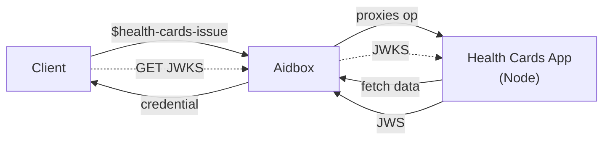
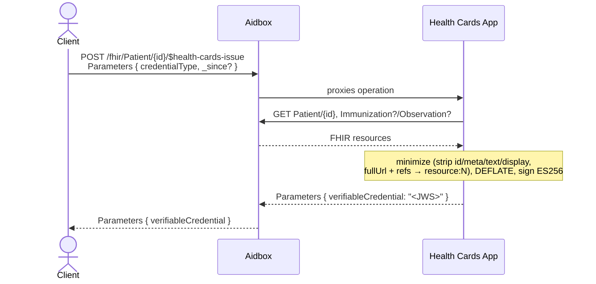
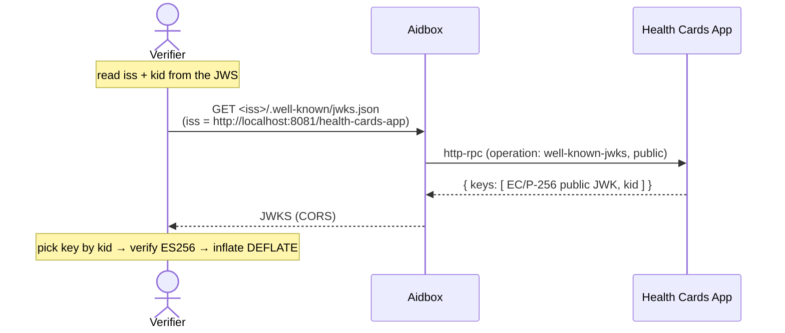
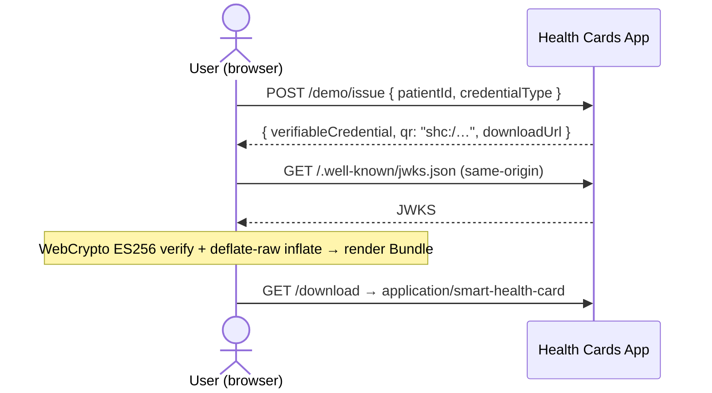

# SMART Health Cards: Issue, Deliver &amp; Verify

A Node/Express implementation of the FHIR [`$health-cards-issue`](https://hl7.org/fhir/uv/smart-health-cards-and-links/STU1/OperationDefinition-patient-i-health-cards-issue.html) operation on [Aidbox](https://www.health-samurai.io/aidbox). It pulls patient data from Aidbox, minimizes it per the [SMART Health Cards spec](https://spec.smarthealth.cards/), and issues a **signed** verifiable credential (JWS/ES256) — delivered three ways: **FHIR API**, **QR (`shc:/`)**, and **`.smart-health-card` file** — plus an in-browser **verifier**.

A SMART Health Card is a FHIR `Bundle` → W3C Verifiable Credential → **JWS (ES256)**, payload minified and **DEFLATE**-compressed (`zip:"DEF"`). It proves *authenticity* via the issuer's signature (public key at `<iss>/.well-known/jwks.json`) — not confidentiality. (Encrypted sharing is the sibling `smart-health-link` example.)

## Architecture



## Flow 1 — Issue (`$health-cards-issue`)



## Flow 2 — Verify (JWKS)

The issuer publishes its **public** key so anyone can verify:

- Aidbox already owns its own `/.well-known/jwks.json` (RSA, for OAuth).
- So the SHC EC key is published under a **namespaced** path: `/health-cards-app/.well-known/jwks.json`.
- `iss` points at that base, so `<iss>/.well-known/jwks.json` resolves to the key.



## Flow 3 — Deliver &amp; verify in the browser



## Endpoints

| Method | Path | Auth | Purpose |
|--------|------|------|---------|
| POST | `/fhir/Patient/{id}/$health-cards-issue` | required | Issue a card |
| GET | `/health-cards-app/.well-known/jwks.json` | public | Issuer JWKS (`= <iss>/.well-known/jwks.json`) |
| GET | `:3001/` | public | Viewer (Issue + Verify) |
| POST | `:3001/demo/issue` | demo | Issue → `{ jws, qr, downloadUrl }` |
| GET | `:3001/download` | demo | `.smart-health-card` file |
| GET | `:3001/.well-known/jwks.json` | public | Same JWKS, same-origin for the viewer |

## Quick Start

```bash
cp .env.example .env
npm install && npm run generate-keys
docker compose up --build
```
Activate Aidbox at [localhost:8081](http://localhost:8081) (init bundle seeds `Patient/example-patient` + a COVID `Immunization` + `Observation`), then open the viewer at [localhost:3001](http://localhost:3001).

## Testing

- **Viewer** (`:3001`): **Issue** a card (`#covid19`, `Immunization`, or `Observation`) → get JWS, QR, and a `.smart-health-card` download, auto-verified. **Verify** any pasted JWS against the JWKS.
- **API**:
  ```http
  POST /fhir/Patient/example-patient/$health-cards-issue
  Content-Type: application/fhir+json

  { "resourceType": "Parameters",
    "parameter": [ { "name": "credentialType", "valueUri": "https://smarthealth.cards#covid19" } ] }
  ```
  Also accepts `Immunization` / `Observation` (uri or string), `_since` (dateTime), `includeIdentityClaim` (string claim paths).
- **`credentialType` mapping**: `#covid19` → COVID `Immunization`s only (filtered by CVX vaccine code); `Immunization` → all immunizations; `Observation` → lab results. All matches go into a single card.
- **`resourceLink` (OUT)**: the response also returns a `resourceLink` per bundled resource, mapping each minified `resource:N` entry back to its live FHIR URL (e.g. `resource:0` → `<fhirBase>/Patient/example-patient`).
- **Spec validator**: paste the JWS at [demo-portals.smarthealth.cards](https://demo-portals.smarthealth.cards/). Header / `zip:DEF` / signature / `kid` / Bundle should be **valid**. Expected warnings (local-dev only): unknown issuer + http keys — paste `keys/public-key.jwk.json` to check the signature.

## Conformance

Built to pass strict verification:
- **JWS** `ES256`, `zip:DEF`, `kid` = base64url SHA-256 JWK thumbprint (RFC 7638).
- Payload minified + **raw-DEFLATE before signing** (jose `SignJWT` doesn't compress; we `deflateRaw` + `CompactSign`).
- Bundle `collection`; strip `id`/`meta`(≠security)/`text`/`Coding.display`; `fullUrl` + refs → `resource:N`.
- JWKS: EC/P-256/`use:sig`/`alg:ES256`/`kid`/`x`/`y`, **no `d`**, CORS; `iss` = the base serving it.

## VCI / trust

Real verifiers check `iss` against the [VCI trusted-issuer directory](https://github.com/the-commons-project/vci-directory) and fetch JWKS over **https (TLS 1.2+)**. This demo self-hosts over `http://localhost` and is not VCI-listed (expected local-dev deviation). Production: https `iss` (no trailing slash) + VCI enrollment.

**Card content &amp; VCI profiles.** For `#covid19`, the bundle content follows the VCI / [US Public Health](https://build.fhir.org/ig/HL7/fhir-us-ph-library/) vaccine-credential profiles **by resource type and codes** — Patient (name + DOB), `Immunization` (CVX vaccine code), and COVID `Observation` (LOINC code + SNOMED value); the seed data is shaped accordingly. We do **not** formally validate against those `StructureDefinition`s or trim to their exact minimal data set — that's out of scope here (note: SHC strips `meta`, so conformance means the *set of elements*, not a `meta.profile` tag). To enforce it, load the IG package into Aidbox and run `$validate` on the issued bundle.

**Out of scope**: SMART-on-FHIR OAuth (Aidbox config), VCI enrollment, formal VCI/us-ph profile validation, revocation, full `credentialValueSet` filtering, key rotation.

## Related

- [`smart-health-link`](../../aidbox-integrations/smart-health-link) — the encrypted-link counterpart (JWE): shares data via a `shlink:` instead of a signed card.
