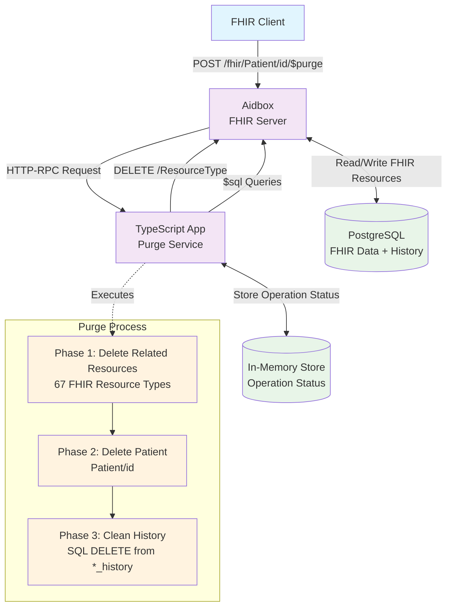

# FHIR $purge Operation with Aidbox

This example demonstrates the implementation of the [FHIR $purge operation](https://build.fhir.org/patient-operation-purge.html) using TypeScript and Aidbox. The $purge operation removes all current and historical versions of resources associated with a specific patient.

The application provides a complete asynchronous implementation of patient data purging, including related resources cleanup and history removal from the database.

## Prerequisites

- [Docker](https://www.docker.com/) and Docker Compose
- [Node.js](https://nodejs.org/) (v18 or later) and npm
- [curl](https://curl.se/) for HTTP requests
- [jq](https://jqlang.github.io/jq/) for JSON processing and formatting

## Setting Up Aidbox

1. Clone the repository:
```bash
git clone git@github.com:Aidbox/examples.git 
```

2. Change to the project directory:
```bash
cd examples/dollar-purge-operation
```

3. Install dependencies:
```bash
npm install
```

4. Start the TypeScript development server:
```bash
npm run dev
```

5. The purge service will be available at http://localhost:3000

6. Start Aidbox and PostgreSQL:
```bash
docker compose up
```

7. The init bundle will automatically configure:
   - **App resource** for the $purge operation endpoint
   - **Basic Client** for API authentication 
   - **Access Policies** for DELETE operations and $sql queries

8. **Log in to in Aidbox at http://localhost:8888**.

## Testing the $purge Operation

**Ready-to-use test resources:** The init bundle automatically creates test data:
- **Patient/test-patient-1**: John Doe (male, born 1980-01-01)
- **Observation**: Blood pressure reading linked to test patient
- **Encounter**: Ambulatory visit linked to test patient  
- **Condition**: Hypertension diagnosis linked to test patient

```bash
# Verify test patient exists
curl "http://localhost:8888/Patient/test-patient-1" -H "Authorization: Basic YmFzaWM6c2VjcmV0" | jq
```

```bash
# Execute $purge on test patient
curl -X POST "http://localhost:8888/fhir/Patient/test-patient-1/\$purge" \
  -H "Authorization: Basic YmFzaWM6c2VjcmV0" \
  -H "Content-Type: application/json" | jq .
```

### Check Operation Status

```bash
curl -X GET "http://localhost:8888/fhir/purge-status/<id-from-purge-response>" \
  -H "Authorization: Basic YmFzaWM6c2VjcmV0" \
  -H "Content-Type: application/json" | jq .
```

### Verify Resources are Deleted

```bash
# Patient should return 404
curl "http://localhost:8888/Patient/test-patient-123" \
  -H "Authorization: Basic YmFzaWM6c2VjcmV0" | jq .
```

```bash
# Related resources should also be deleted
curl "http://localhost:8888/fhir/Observation" \
  -H "Authorization: Basic YmFzaWM6c2VjcmV0" | jq .
```

## What's Going On Under the Hood?

### Three-Phase Purge Algorithm

The $purge operation implements a comprehensive 3-phase deletion process:

#### Phase 1: Delete Related Resources
- Checks up to **60+ different FHIR resource types** that may reference the patient. See `src/resourceDeletions.ts`.
- Uses **Conditional DELETE** for efficient bulk deletion: `DELETE /fhir/ResourceType?patient=Patient/{id}`
- **Smart detection**: HTTP 204 responses indicate no resources found - these are skipped from counting (no such resources).
- **Fallback mechanism**: If conditional delete fails with "multiple matches" error, falls back to individual DELETE operations
- Resource types include: Observation, Encounter, Condition, AllergyIntolerance, CarePlan, and 62 others

#### Phase 2: Delete Patient
- Removes the patient resource itself: `DELETE /fhir/Patient/{id}`

#### Phase 3: Clean History Tables  
- Uses **$sql operation** to remove historical versions from `*_history` tables
- **Optimized cleanup**: Only processes history for resource types where data was actually deleted
- Executes SQL queries like: `DELETE FROM observation_history WHERE resource->>'subject' = 'Patient/{id}'`

### Error Handling

- **Graceful degradation**: Continues processing even if some resource types fail
- **Multiple matches fallback**: Automatically switches to individual DELETE when conditional DELETE fails
- **Partial success tracking**: Reports which resources were successfully deleted
- **Comprehensive error logging**: All failures are recorded in the operation outcome

## API Endpoints

### Primary Endpoints (via Aidbox)

| Method | Endpoint | Description |
|--------|----------|-------------|
| `POST` | `/fhir/Patient/{id}/$purge` | Start purge operation for patient |
| `GET` | `/fhir/purge-status` | Get status of purge operation |

### Monitoring Endpoints (Direct to TypeScript service)

| Method | Endpoint | Description |
|--------|----------|-------------|
| `GET` | `/purge-status/{operationId}` | Check operation status |
| `GET` | `/purge-operations` | List all operations |
| `GET` | `/health` | Health check |

## FHIR $purge Operation Specification

According to the [FHIR specification](https://build.fhir.org/patient-operation-purge.html):

- **Purpose**: Remove all current and historical versions of resources associated with a patient
- **Scope**: Patient and all linked resources (observations, encounters, conditions, etc.)
- **Behavior**: Idempotent operation that can be safely retried
- **Return**: OperationOutcome with execution status
- **Maturity Level**: 2 (Trial Use)

### Implementation Notes

This implementation provides:
- ✅ **Complete resource coverage**: Checks all 67 FHIR resource types that can reference patients
- ✅ **Smart resource counting**: Only counts resources that were actually deleted (not empty checks)
- ✅ **Optimized history cleanup**: Only processes history for resource types with deleted data
- ✅ **Asynchronous processing**: Prevents timeouts on large datasets
- ✅ **Progress tracking**: Real-time status updates with accurate counts
- ✅ **Error resilience**: Continues processing despite partial failures
- ✅ **Fallback mechanisms**: Handles edge cases like multiple matches

### Example: Successful Operation Response

```json
{
  "resourceType": "OperationOutcome",
  "issue": [{
    "severity": "information",
    "code": "success", 
    "details": {
      "text": "Purge completed successfully. Processed 67 resource types. Deleted 4 resources."
    }
  }]
}
```

### Example: Operation with Warnings

```json
{
  "resourceType": "OperationOutcome", 
  "issue": [{
    "severity": "warning",
    "code": "incomplete",
    "details": {
      "text": "Purge completed with errors. Processed 67 resource types. Deleted 4 resources. Errors: 3"
    }
  }]
}
```

## Architecture Overview



## Development

### Project Structure

```
dollar-purge-operation/
├── src/
│   ├── index.ts              # Express server
│   ├── purgeHandler.ts       # Main purge logic
│   ├── resourceDeletions.ts  # Resource type definitions
│   └── types.ts              # TypeScript interfaces
├── tasks/                    # Implementation tasks documentation
├── docker-compose.yml        # Aidbox + PostgreSQL
├── init-bundle.json          # Aidbox configuration
└── package.json              # Node.js dependencies
```

### Key Technologies

- **TypeScript**: Type-safe backend implementation
- **Express.js**: HTTP server for handling requests
- **Aidbox**: FHIR server and database
- **PostgreSQL**: Data storage with JSONB support
- **Docker Compose**: Local development environment

## Configuration

### Customizing Resource Types for Deletion

The list of FHIR resource types that are checked during the purge operation is defined in `src/resourceDeletions.ts`. You can customize this list based on your specific FHIR implementation needs.

#### Location of Resource Definitions

```typescript
// src/resourceDeletions.ts
export const RESOURCE_DELETIONS: ResourceDeletion[] = [
  { resourceType: 'Account', conditionalParams: 'subject=Patient/%s', historyTableName: 'account_history' },
  { resourceType: 'AdverseEvent', conditionalParams: 'subject=Patient/%s', historyTableName: 'adverseevent_history' },
  // ... 65 more resource types
];
```

#### Resource Definition Structure

Each resource type definition includes:
- **resourceType**: The FHIR resource type name
- **conditionalParams**: The search parameter for finding resources linked to a patient
  - `%s` is replaced with the patient ID at runtime
  - Common patterns: `patient=Patient/%s`, `subject=Patient/%s`, `beneficiary=Patient/%s`
- **historyTableName**: The PostgreSQL table name for historical versions

#### Adding a New Resource Type

To add support for a custom resource type:

```typescript
// Add to RESOURCE_DELETIONS array
{
  resourceType: 'CustomResource',
  conditionalParams: 'patient=Patient/%s',  // or appropriate search parameter
  historyTableName: 'customresource_history'
}
```

#### Removing Resource Types

To skip checking certain resource types, simply remove or comment out the corresponding entry from the `RESOURCE_DELETIONS` array.

### Performance Considerations

- The system checks all configured resource types but only deletes and counts those with actual data
- History cleanup is automatically optimized to run only for resource types where data was deleted
- You can reduce processing time by removing resource types that your implementation doesn't use

This implementation demonstrates a production-ready approach to implementing complex FHIR operations with proper error handling, monitoring, and data integrity guarantees.
