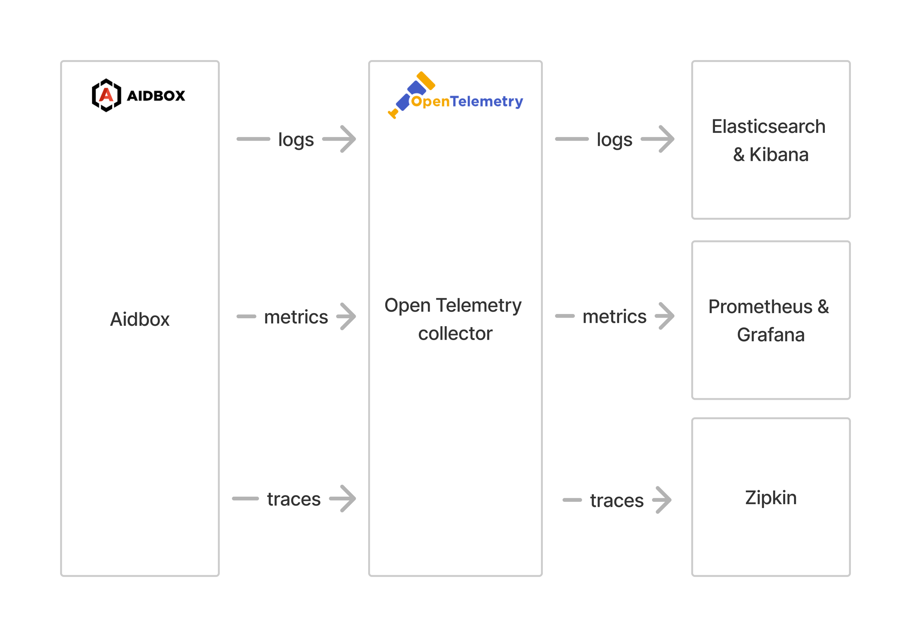
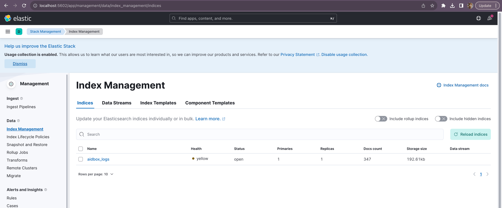
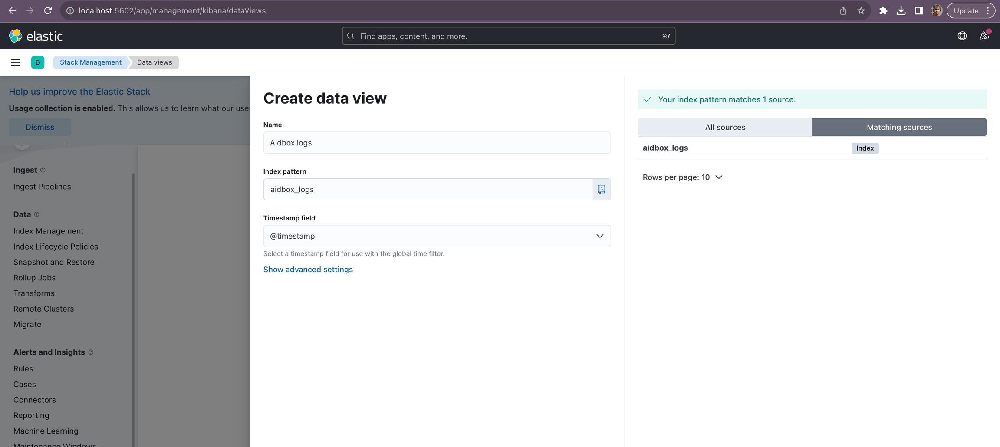
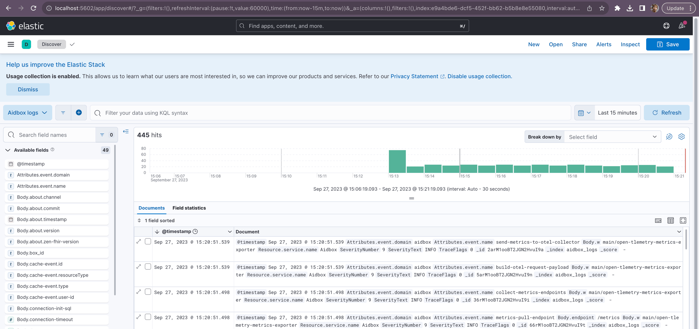
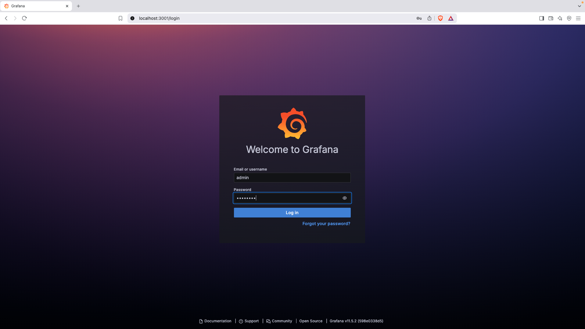
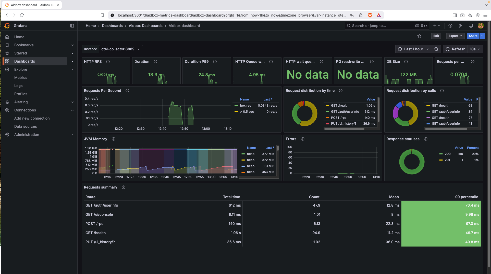
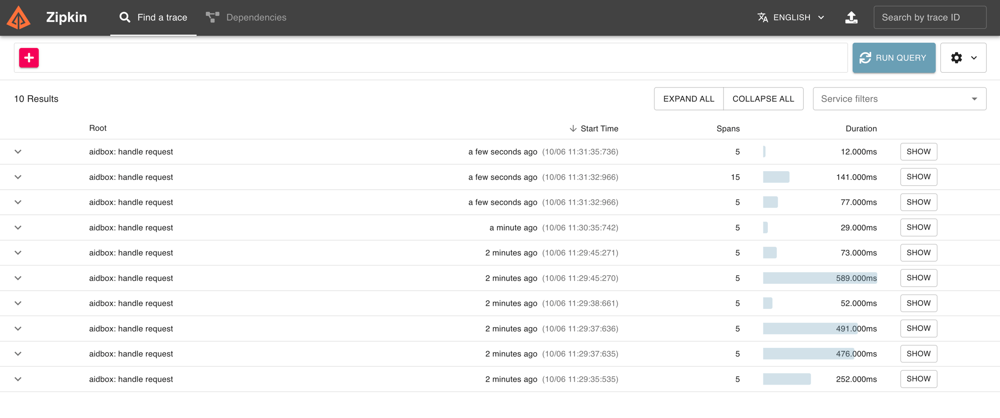
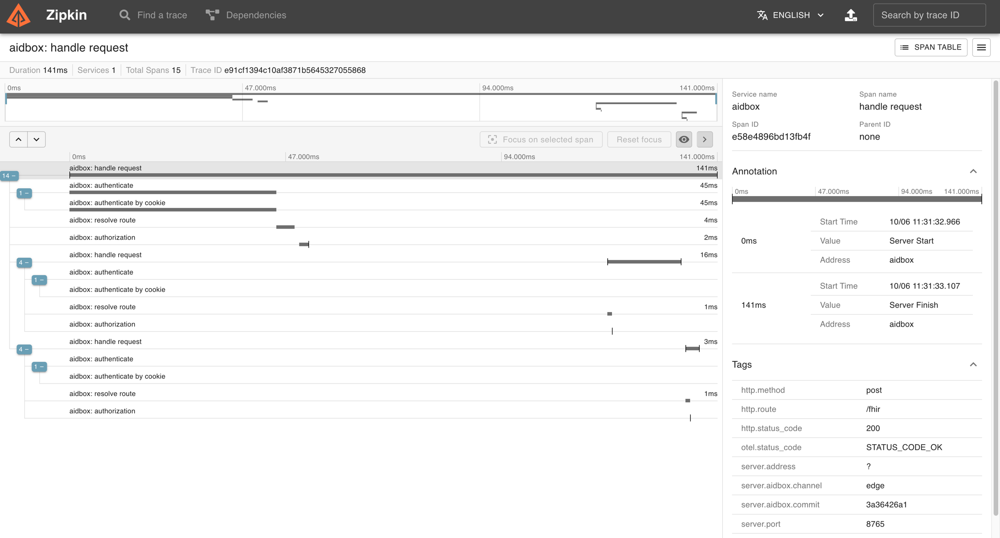

# OpenTelemetry

This demo helps you to launch and explore the Aidbox observability features locally.

It introduces you to:

- The Aidbox installation process with Docker & Docker Compose,
- Logs & metrics & traces exporting to Elasticsearch & Prometheus & Zipkin using OpenTelemetry collector service.



## Prerequisites

* [Docker](https://www.docker.com/)
* Cloned repository: [Github: Aidbox/examples](https://github.com/Aidbox/examples/tree/main)
* Working directory: `OpenTelemetry`

To clone the repository and navigate to the `OpenTelemetry` directory, run:

```sh
git clone git@github.com:Aidbox/examples.git && cd examples/OpenTelemetry
```

## 1. Start Aidbox and demo components with Docker Compose

```shell
docker compose up --force-recreate
```

Wait until all components are pulled and started. 

## 2. Activate Aidbox

Open Aidbox on [http://localhost:8080](http://localhost:8080) address, activate it and login with `admin`/`password` credentials.

## 3. Discover Aidbox logs with Kibana

Kibana should be available on [http://localhost:5602](http://localhost:5602) address. To see logs in Kibana we should

* make sure that logs are coming to Elasticsearch and then
* create a data view to observe over logs.

Go to [Index Management](http://localhost:5602/app/management/data/index_management/indices) page in Kibana (Menu → Stack Management → Index Management). You should see `aidbox_logs` index there.



Then we should go to [Data Views](http://localhost:5602/app/management/kibana/dataViews) page (Menu → Stack Management → Data Views) and create a data view there.



Then go to [Discover](http://localhost:5602/app/discover) page (Menu → Discover) and observe your logs.



## 4. Discover Aidbox metrics with Grafana

Grafana should be available on [http://localhost:3001](http://localhost:3001) address, login with `admin`/`password` credentials.



Navigate to `Dashboards->Aidbox Dashboards->Aidbox Dashboard` to see the dashboard.
You probably need to wait for a while until the data is collected.



## 6. Discover Aidbox traces with Zipkin

Zipkin should be available on [http://localhost:9411/](http://localhost:9411/zipkin/) address. To see traces in Zipkin click the `Run query` button.



Click the `Show` button to see all spans of a certain request.




