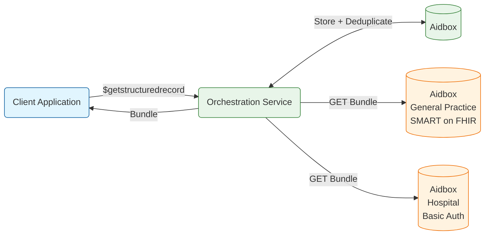
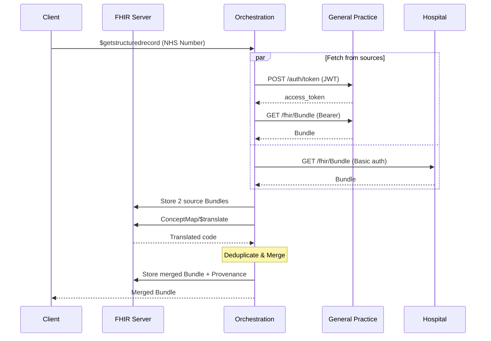

# FHIR Orchestration Service

Implements [`$getstructuredrecord`](https://simplifier.net/guide/gpconnect-data-model/Home/FHIR-Assets/All-assets/OperationDefinitions/OperationDefinition-GPConnect-GetStructuredRecord-Operation-1?version=current) operation that fetches patient data from multiple FHIR sources, deduplicates resources using terminology translation, and returns a merged Bundle with Provenance tracking.

## Problem

Patient data is often spread across multiple healthcare systems that use different terminologies (SNOMED CT, LOINC) and authentication methods (SMART Backend Services, Basic Auth). A client application needs a single, deduplicated view of the patient record.

### Requirements

1. **Multi-source aggregation**: Fetch data from General Practice (SMART on FHIR) and Hospital (Basic Auth) in parallel
2. **Cross-terminology deduplication**: Match resources coded in different systems (LOINC vs SNOMED CT) using [ConceptMap/$translate](https://hl7.org/fhir/R4/conceptmap-operation-translate.html)
3. **Audit trail**: Store source bundles and merged results with [Provenance](https://hl7.org/fhir/R4/provenance.html)

## Architecture



For the POC, all three FHIR servers are Aidbox instances. In production, the external sources would be real GP and Hospital FHIR servers.

## Sequence Diagram



### Flow

1. **Client request** - Client calls `$getstructuredrecord` with patient's NHS Number
2. **Parallel fetch** - Orchestration fetches bundles from both sources simultaneously:
   - General Practice: SMART Backend Services auth (JWT client assertion -> Bearer token)
   - Hospital: Basic authentication
3. **Store for audit** - Source bundles, merged bundle, and Provenance stored in main FHIR Server
4. **Terminology normalization** - `ConceptMap/$translate` converts LOINC codes to SNOMED CT for cross-system matching
5. **Deduplication** - Resources with matching normalized codes are deduplicated
6. **Response** - Merged bundle with deduplicated resources returned to client

## Deduplication Algorithms

| Resource               | Key                     | Algorithm                | Why?                                                             |
| ---------------------- | ----------------------- | ------------------------ | ---------------------------------------------------------------- |
| **Patient**            | NHS Number              | Merge                    | One person = one patient, combine data from sources              |
| **AllergyIntolerance** | code (normalized)       | Match + select by status | Same allergy in different terminologies -> ConceptMap translation |
| **Observation**        | code + time +/-1h + value | Match if all equal       | Same measurement, but different values = clinically significant  |
| **Encounter**          | -                       | No deduplication         | Each visit is unique, even on the same day                       |

### Patient

```
1. Group by NHS Number
2. Merge: keep most complete name (more given names wins)
3. Merge: take first non-null telecom, address
4. Result: single Patient with merged data
```

### AllergyIntolerance

```
1. Translate LOINC codes to SNOMED CT via ConceptMap/$translate
2. Group by normalized SNOMED code
3. Select canonical: prefer confirmed verificationStatus
```

Example:

```
General Practice: SNOMED 91936005 (confirmed)   -+
Hospital:         LOINC LA30099-6 (unconfirmed)  -+-> translate -> match -> keep GP (confirmed)
```

### Observation

```
1. Group by: code + effectiveDateTime (+/-1h)
2. Compare values:
   - Same value -> deduplicate
   - Different value -> keep both (clinical significance)
3. Select canonical: prefer has interpretation, has referenceRange
```

Example:

```
GP:       HbA1c = 7.2% @ 10:00  -+-> same code, +/-1h, same value -> deduplicate
Hospital: HbA1c = 7.2% @ 10:30  -+

GP:       HbA1c = 7.2% @ 10:00  -> keep
Hospital: HbA1c = 6.8% @ 10:30  -> keep (different value = clinically significant)
```

## Quick Start

### 1. Configure environment

```bash
cp .env.example .env
```

The `.env.example` includes a test RSA private key for SMART Backend Services authentication. The matching public key is already configured in `general-practice-config/init.json`.

### 2. Start services

```bash
docker compose up -d --build
```

Wait for all services to become healthy:

```bash
docker compose ps
```

All 4 services should show "healthy" status:
- http://localhost:8080 - Main FHIR server (Aidbox UI)
- http://localhost:8081 - General Practice FHIR server
- http://localhost:8082 - Hospital FHIR server
- http://localhost:3000 - Orchestration service

Each Aidbox instance loads its init bundle on startup:

- **fhir_server**: ConceptMap for LOINC->SNOMED CT translation (`aidbox-config/`)
- **general_practice**: Test patient bundle with SNOMED CT codes (`general-practice-config/`)
- **hospital**: Test patient bundle with LOINC codes (`hospital-config/`)

### 3. Test the orchestration

```bash
curl -X POST http://localhost:3000/fhir/Patient/\$getstructuredrecord \
  -H "Content-Type: application/fhir+json" \
  -d '{
    "resourceType": "Parameters",
    "parameter": [{
      "name": "patientNHSNumber",
      "valueIdentifier": {
        "system": "https://fhir.nhs.uk/Id/nhs-number",
        "value": "9876543210"
      }
    }]
  }'
```

Expected response: Merged bundle with 1 Patient, 1 AllergyIntolerance (2->1 deduplicated via ConceptMap), 2 Observations (3->2 deduplicated), 2 Encounters.

### 4. Verify Provenance

Provenance resources are stored for audit but not included in response:

```bash
curl -u root:secret http://localhost:8080/fhir/Provenance
```

## Test Data

All resources conform to [UK Core STU2](https://simplifier.net/hl7fhirukcorer4) profiles.

**General Practice (SNOMED CT):**

- [UKCore-Patient](https://simplifier.net/hl7fhirukcorer4/ukcorepatient): NHS 9876543210, Smith John William, address + telecom
- [UKCore-AllergyIntolerance](https://simplifier.net/hl7fhirukcorer4/ukcoreallergyintolerance): SNOMED `91936005` (Allergy to penicillin), confirmed, high criticality
- [UKCore-Observation](https://simplifier.net/hl7fhirukcorer4/ukcoreobservation): HbA1c = 7.2% @ 2024-01-15T10:00 (with interpretation + referenceRange)
- [UKCore-Encounter](https://simplifier.net/hl7fhirukcorer4/ukcoreencounter): ENC-SMART-001

**Hospital (LOINC):**

- [UKCore-Patient](https://simplifier.net/hl7fhirukcorer4/ukcorepatient): NHS 9876543210, Smith John, local ID H12345
- [UKCore-AllergyIntolerance](https://simplifier.net/hl7fhirukcorer4/ukcoreallergyintolerance): LOINC `LA30099-6` (Penicillin allergy), unconfirmed
- [UKCore-Observation](https://simplifier.net/hl7fhirukcorer4/ukcoreobservation): HbA1c = 7.2% @ 2024-01-15T10:30 (duplicate)
- [UKCore-Observation](https://simplifier.net/hl7fhirukcorer4/ukcoreobservation): HbA1c = 6.8% @ 2024-02-20T14:00 (unique)
- [UKCore-Encounter](https://simplifier.net/hl7fhirukcorer4/ukcoreencounter): ENC-BASIC-001

**Result after orchestration:**

| Resource           | Source             | Result | Reason                                                                    |
| ------------------ | ------------------ | ------ | ------------------------------------------------------------------------- |
| Patient            | 2 (GP + Hospital)  | 1      | Merged by NHS Number, kept "John William" (more given names)              |
| AllergyIntolerance | 2 (SNOMED + LOINC) | 1      | LOINC->SNOMED translation matched, kept GP's (confirmed > unconfirmed)    |
| Observation (Jan)  | 2 (GP + Hospital)  | 1      | Same code, +/-30min, same value -> duplicate, kept GP's (has interpretation) |
| Observation (Feb)  | 1 (Hospital only)  | 1      | Unique date, no match                                                     |
| Encounter          | 2 (GP + Hospital)  | 2      | No deduplication (different identifiers)                                  |

## Services

| Service            | URL                   | Auth                   | Description                  |
| ------------------ | --------------------- | ---------------------- | ---------------------------- |
| `fhir_server`      | http://localhost:8080  | Basic (root:secret)    | Main FHIR server (storage)   |
| `general_practice` | http://localhost:8081  | SMART Backend Services | General Practice (SNOMED CT) |
| `hospital`         | http://localhost:8082  | Basic Auth             | Hospital (LOINC)             |
| `orchestration`    | http://localhost:3000  | -                      | Orchestration service        |

## FHIR Implementation Guides

| Package                                                       | Version | Description                                                                            |
| ------------------------------------------------------------- | ------- | -------------------------------------------------------------------------------------- |
| [hl7.fhir.r4.core](https://hl7.org/fhir/R4/)                  | 4.0.1   | FHIR R4 base types                                                                     |
| [fhir.r4.ukcore.stu2](https://simplifier.net/hl7fhirukcorer4) | 2.0.2   | UK Core R4 profiles (UKCorePatient, UKCoreAllergyIntolerance, UKCoreObservation, etc.) |

TypeScript types for both packages are generated into `src/fhir-types/` using `@atomic-ehr/codegen`.

## Local Development

```bash
bun install
bun run src/index.ts
bun run tsc --noEmit
```
