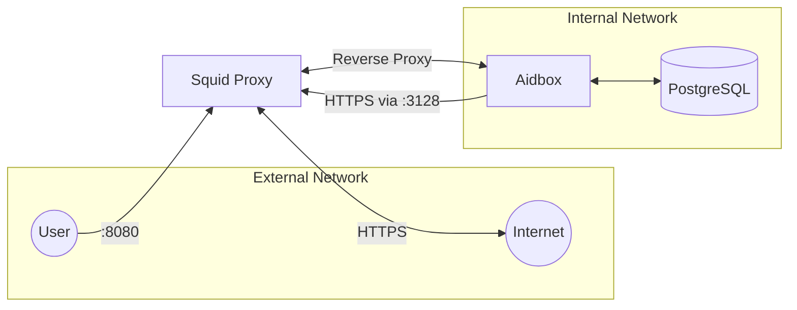

# Using Aidbox with Outbound Proxy

This guide demonstrates how to configure Aidbox to route outbound HTTPS traffic through a proxy server (Squid). This is useful in enterprise environments where all external traffic must go through a corporate proxy for security, compliance, or monitoring purposes.

## Overview

In many enterprise environments, direct internet access is restricted and all outbound traffic must be routed through a proxy server. This example shows how to:

- **Network Isolation**: Run Aidbox in an internal network without direct internet access
- **Proxy Configuration**: Route outbound HTTPS traffic through a Squid proxy
- **Reverse Proxy Access**: Expose Aidbox through the proxy for external access

Common use cases include:

- Corporate environments requiring traffic inspection
- Compliance requirements for logging all external communications
- Security policies that restrict direct internet access
- Environments where terminology servers or other external services must be accessed via proxy

## Architecture

This setup uses Docker networks to isolate Aidbox from external access while allowing it to reach the internet through a Squid proxy.



### Network Configuration

- **Internal Network**: Aidbox and PostgreSQL run on an isolated internal network with no direct internet access
- **External Network**: Squid proxy has access to both internal and external networks
- **Proxy Ports**:
  - Port `3128`: Forward proxy for outbound HTTPS traffic from Aidbox
  - Port `8080`: Reverse proxy for accessing Aidbox UI/API

## Prerequisites

- [Docker](https://www.docker.com/)
- Clone the repository and navigate to the working directory:
  ```sh
  git clone https://github.com/Aidbox/examples.git
  cd aidbox-features/aidbox-outbound-proxy
  ```

## Up and Running

Below is a Docker Compose configuration ([docker-compose.yaml](./docker-compose.yaml)) that sets up:

1. A PostgreSQL database on the internal network
2. Aidbox configured to use the proxy for outbound HTTPS traffic
3. A Squid proxy server bridging internal and external networks

```shell
docker-compose up
```

### Configuration

Pay special attention to the `JAVA_OPTS` environment variable that configures the HTTPS proxy for Aidbox:

```yaml
JAVA_OPTS: "-Dhttps.proxyHost=squid -Dhttps.proxyPort=3128"
```

This Java system property tells Aidbox to route all outbound HTTPS connections through the Squid proxy.

#### Squid Proxy Configuration

The [squid.conf](./squid.conf) file configures Squid to:

1. **Forward Proxy** (port 3128): Handle outbound HTTPS traffic from Aidbox
2. **Reverse Proxy** (port 8080): Provide access to Aidbox from external clients

Key configuration sections:

```squid
# Forward proxy port
http_port 3128

# Reverse proxy to Aidbox
http_port 8080 accel vhost
cache_peer aidbox parent 8080 0 no-query originserver name=aidbox
```

## Usage Examples

### Initializing Aidbox

1. Navigate to [Aidbox UI](http://localhost:8080) and [initialize](https://docs.aidbox.app/getting-started/run-aidbox-locally#id-4.-activate-your-aidbox-instance) the Aidbox instance. 
  
   The initialization process requires a connection to access to the package registry to download the FHIR core package - that will go through the proxy. If you restart Aidbox it will connect to the license server to validate your license - that will go through the proxy.

### Verifying Proxy Usage

To confirm that Aidbox is using the proxy, monitor Squid's access logs:

```shell
docker-compose exec squid tail -f /var/log/squid/access.log
```

## Additional Resources

- [Squid Proxy Documentation](http://www.squid-cache.org/Doc/)
- [Java Networking and Proxies](https://docs.oracle.com/javase/8/docs/technotes/guides/net/proxies.html)
