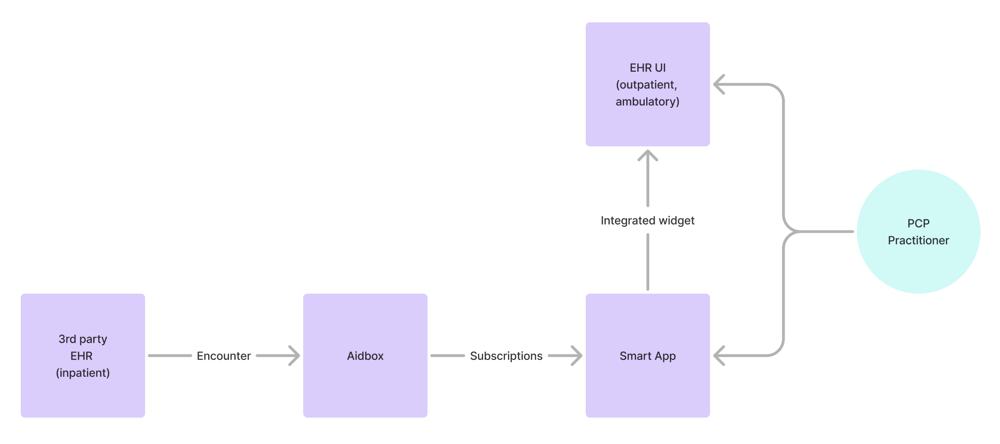
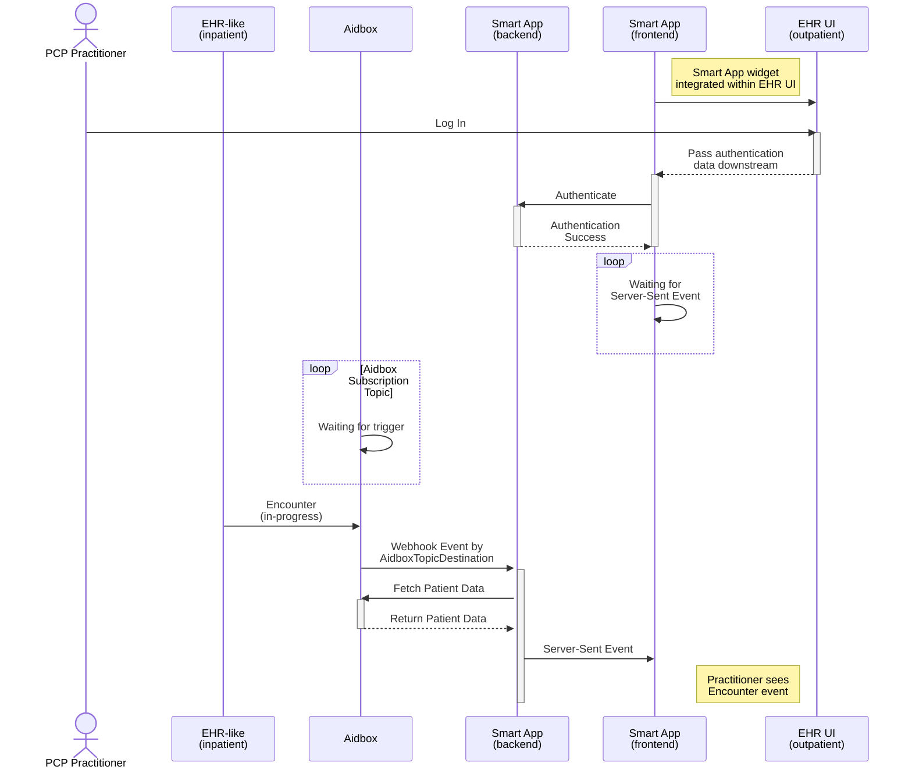

# Smart App Launch Subscriptions

## Description
The Smart App Launch Subscriptions is a fullstack application which allows to integrate widget into your EHR UI.
Widget allows to receive and display notifications about Encounter of relevant Patient of PCP Practitioner.

## Use Case Description
 **Use Case**: Integration of Inpatient and Outpatient EHR Systems with Smart App for PCP Practitioners

#### Actors:
- **3rd Party EHR (Inpatient)**: An external Electronic Health Record system used for inpatient encounters.

- **Aidbox**: A FHIR-based backend that aggregates and manages healthcare data.

- **Smart App**: A healthcare application that processes patient encounter data and integrates with outpatient EHR systems.

- **EHR UI (Outpatient, Ambulatory)**: The front-end system used by healthcare practitioners for outpatient and ambulatory care.

- **PCP Practitioner**: The primary care provider (PCP) who interacts with the system through the EHR UI and Smart App.

### Component Diagram



### Workflow
**1. Encounter Creation in 3rd Party EHR (Inpatient):**
- A patient has an encounter in an inpatient setting.

**2.Data Transfer to Aidbox:**
- The encounter information is sent to Aidbox, which acts as an intermediary FHIR-based data storage and processing layer.

**3.Subscription to Updates by Smart App:**
- Smart App subscribes to Aidbox to receive real-time updates on patient encounters.

**4.Integration with Outpatient EHR UI:**
- The Smart App processes the encounter data and integrates with the EHR UI (Outpatient, Ambulatory) through an embedded widget.

**5.PCP Practitioner Interaction:**
- The PCP Practitioner accesses patient encounter data through the EHR UI.
- The practitioner can view and interact with the encounter data via the Smart App widget integrated into the EHR system.

# Components

1. [Aidbox](https://docs.aidbox.app/modules/security-and-access-control/smart-on-fhir) 
    FHIR server with SMART-on-FHIR support.
2. **Subscriptions Widget**  
   A widget that receives and displays notifications from Subscriptions resource.

# Prerequisites

- [Docker](https://www.docker.com/)
- Cloned repository: [Github: Aidbox/examples](https://github.com/Aidbox/examples/tree/main)
- Working directory: `smart-app-launch-subscriptions`

For cloning of the repository and navigation to the `smart-app-launch-subscriptions` directory, run:

``` sh
git clone git@github.com:Aidbox/examples.git && cd examples/smart-app-launch-subscriptions
```

# Step 1: Run Demo Components

Start all the demo components by running:

```sh
docker compose up
```

Wait until all components are pulled and started. The components are accessible at:

- Aidbox - http://localhost:8080  
- Smart App Subscriptions backend - http://localhost:9000
- Example HTML page - http://localhost:7070
- Example React page - http://localhost:7080

# Step 2: Create Subscription resources in Aidbox

Open [Aidbox](http://localhost:8080), log in using the username `admin` and the password `password`, then go to [API REST console](http://localhost:8080/ui/console#/rest) and run the following requests:

**1. Create SubscriptionTopic**
```
POST /fhir/AidboxSubscriptionTopic
content-type: application/json
accept: application/json

{
  "resourceType": "AidboxSubscriptionTopic",
  "url": "http://example.org/FHIR/R5/SubscriptionTopic/Encounter-in-progress",
  "status": "active",
  "trigger": [
    {
      "resource": "Encounter",
      "fhirPathCriteria": "Encounter.status = 'in-progress'"
    }
  ]
}
```

**2. Create TopicDestination**

```
POST /fhir/AidboxTopicDestination
content-type: application/json
accept: application/json

{
  "resourceType": "AidboxTopicDestination",
  "meta": {
    "profile": [
      "http://aidbox.app/StructureDefinition/aidboxtopicdestination-webhook-at-least-once"
    ]
  },
  "kind": "webhook-at-least-once",
  "id": "webhook-destination",
  "topic": "http://example.org/FHIR/R5/SubscriptionTopic/Encounter-in-progress",
  "parameter": [
    {
      "name": "endpoint",
      "valueUrl": "http://subscriptions:9000/subscriptions/webhook-to-post-all-new-subscriptions-aidbox"
    },
    {
      "name": "timeout",
      "valueUnsignedInt": 30
    },
    {
      "name": "maxMessagesInBatch",
      "valueUnsignedInt": 20
    },
    {
      "name": "header",
      "valueString": "User-Agent: Aidbox Server"
    }
  ],
  "content": "full-resource"
}
```

# Step 3: Open Launcher Pages

**1. There are two examples:**
- open `http://localhost:7070` to see example in plain HTML
- open `http://localhost:7080` to see example in React

**2. Login into account**

Use login credentials from `aidbox.json`:

- Email: `house@example.com`
- Password: `securepassword`

# Step 4: Trigger EHR Encounter

Open [API REST console](http://localhost:8080/ui/console#/rest) in Aidbox and run the following requests:

**1. Mock Encounter**
```
POST /fhir/Encounter

{
  "resourceType": "Encounter",
  "subject": {
    "resourceType": "Patient",
    "id": "example-patient"
  },
  "class": {
    "code": "IMP",
    "system": "http://terminology.hl7.org/CodeSystem/v3-ActCode",
    "display": "inpatient encounter"
  },
  "status": "in-progress",
  "diagnosis": [
    {
      "use": {
        "coding": [
          {
            "code": "DD"
          }
        ]
      },
      "condition": {
        "reference": "Condition/example-condition-from-encounter"
      }
    }
  ],
  "serviceProvider": {
      "display": "Test Hospital",
      "reference": "Organization/example-organization"
  },
   "period": {
    "start": "2025-03-11T00:00:00-04:56"
  },
  "length": {
    "code": "d",
    "unit": "days",
    "value": 6,
    "system": "http://unitsofmeasure.org"
  },
  "participant": [
    {
      "type": [
        {
          "coding": [
            {
              "code": "PPRF"
            }
          ]
        }
      ],
      "individual": {
        "display": "Doe John",
        "reference": "Practitioner/example-practitioner-as-participant"
      }
    }
  ]
}
```

# Interaction Diagram



# How to integrate widget in your EHR UI

[View frontend README](front/README.md)

# Misc

For connection of webhook to local backend instance change `valueUrl` to this url: `http://host.docker.internal:9000/subscriptions/webhook-to-post-all-new-subscriptions-aidbox`
