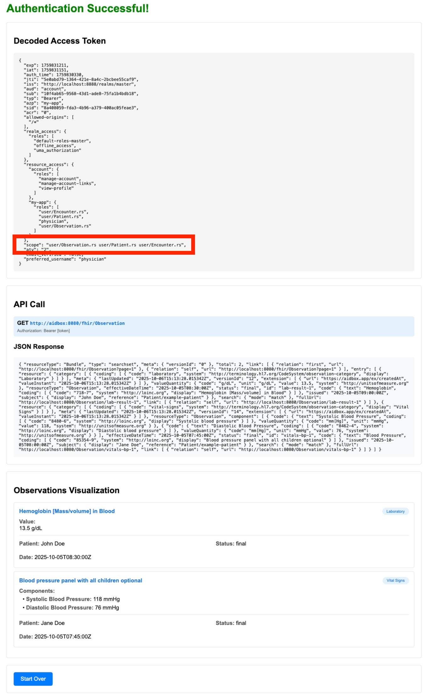
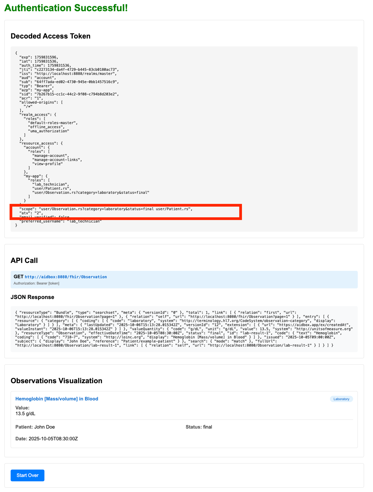

# Managing user Roles in Keycloak using SMART on FHIR V2 scopes

This example demonstrates how to implement role-based access control (RBAC) for FHIR resources using Keycloak and SMART on FHIR V2 scopes.

The demo application is a Bun/TypeScript web application that authenticates users through Keycloak and makes requests to the Aidbox FHIR Server. Depending on the user's role in Keycloak, the same API call (`GET /fhir/Observation`) returns different results:

- **Physician role**: Can access all observations (laboratory results and vital signs)
- **Lab Technician role**: Can only access laboratory observations with final status

This is achieved by mapping Keycloak roles to SMART on FHIR V2 scopes, which Aidbox automatically enforces without additional configuration.

## Keycloak Configuration

### 1. Client Configuration
The `my-app` client is configured in Keycloak with:
- Client ID: `my-app`
- Client authentication enabled (confidential client)
- Standard OpenID Connect flow with authorization code grant

### 2. Role Configuration
Keycloak roles are structured in two layers:

**Basic Roles** (represent individual SMART on FHIR V2 scopes):
- `user/Patient.rs` - read and search Patient data
- `user/Encounter.rs` - read and search Encounter data
- `user/Observation.rs` - read and search all Observation data
- `user/Observation.rs?category=laboratory&status=final` - read and search laboratory Observations with final status only

**Composite Roles** (combine basic roles into meaningful job functions):
- `physician` - Full clinical access:
  - `user/Patient.rs`
  - `user/Encounter.rs`
  - `user/Observation.rs`

- `lab_technician` - Limited to lab results:
  - `user/Patient.rs`
  - `user/Observation.rs?category=laboratory&status=final`

### 3. User Configuration
Two test users are created in Keycloak:
- **physician** (password: `password`) - assigned the `physician` composite role
- **lab_technician** (password: `password`) - assigned the `lab_technician` composite role

### 4. Token Mapper Configuration
Keycloak is configured with a custom protocol mapper to:
- Automatically resolve composite roles into their constituent basic roles
- Include the resolved SMART scopes in the `scope` claim of the access token
- Add the `atv` (authorization token version) claim with value `"2"` to indicate SMART on FHIR V2

**Example access token for the `lab_technician` user:**
```json
{
  "scope": "user/Patient.rs user/Observation.rs?category=laboratory&status=final",
  "atv": "2"
}
```

When Aidbox receives this token, it automatically enforces the SMART scopes, allowing only the specified resources and applying query parameter restrictions.

## Aidbox Configuration

Aidbox is preconfigured via `init-bundle.json` with:
- **TokenIntrospector** - Validates JWT tokens from Keycloak using JWKS
- **AccessPolicy** - Allows requests with tokens issued by Keycloak

### Automatic SMART Scope Enforcement

No additional configuration is required for SMART scope enforcement. Aidbox automatically enforces access control when it detects:

1. **`atv: "2"`** claim in the access token (indicates SMART on FHIR V2)
2. **SMART scopes** in the `scope` claim (e.g., `user/Patient.rs`, `user/Observation.rs?category=laboratory`)

When both conditions are met, Aidbox:
- Parses the SMART scopes to determine allowed resources and operations
- Applies resource type restrictions (e.g., only `Patient`, `Observation`)
- Enforces query parameter filters (e.g., `?category=laboratory&status=final`)
- Returns only data that matches the scope constraints

For example, a request to `GET /fhir/Observation` with scope `user/Observation.rs?category=laboratory&status=final` will automatically filter results to only laboratory observations with final status.

Learn more about [SMART scopes in Aidbox](https://www.health-samurai.io/docs/aidbox/access-control/authorization/smart-on-fhir/smart-scopes-for-limiting-access).

## Getting Started

### Prerequisites

- Docker

### Running the example

1. **Run docker compose**
   ```bash
   docker compose up --build
   ```

2. **Initialize Aidbox instance**
Navigate to [Aidbox UI](http://localhost:8080) and [initialize](https://docs.aidbox.app/getting-started/run-aidbox-locally#id-4.-activate-your-aidbox-instance) the Aidbox instance.

3. **Test the access control**

   Navigate to the demo application at [http://localhost:3000](http://localhost:3000)

   #### Test 1: Physician User (Full Access)

   Login with the physician credentials:
   ```
   Username: physician
   Password: password
   ```

   **Expected Result:**
   You should see **both observations**:
   - **Hemoglobin** (laboratory observation with final status)
   - **Blood Pressure** (vital signs observation)

   This is because the physician role has the `user/Observation.rs` scope, which grants unrestricted read access to all Observation resources.

   

   #### Test 2: Lab Technician User (Restricted Access)

   Logout by clicking the **Start Over** button and login with the lab technician credentials:
   ```
   Username: lab_technician
   Password: password
   ```

   **Expected Result:**
   You should see **only one observation**:
   - **Hemoglobin** (laboratory observation with final status)

   The Blood Pressure observation is not visible because the lab_technician role has the restricted scope `user/Observation.rs?category=laboratory&status=final`, which only allows access to laboratory observations with final status.

   

## Appendix: Custom Keycloak Protocol Mapper Configuration

This section explains the advanced Keycloak configuration that enables automatic role-to-scope mapping. **Note:** This is already preconfigured in the example via `docker-compose.yaml` and the included `oidc-script-based-protocol-mapper.jar` file.

### Overview

The key challenge is mapping Keycloak's composite roles to SMART on FHIR scopes in the access token. Keycloak doesn't natively resolve composite roles into their constituent basic roles for the scope claim. To solve this, we use two protocol mappers:

1. **Script-based mapper** - Resolves the user's composite role (e.g., `physician`) into basic roles (e.g., `user/Patient.rs`, `user/Observation.rs`) and formats them as SMART scopes in the token's `scope` claim
2. **Hardcoded claim mapper** - Adds the `atv: "2"` claim to indicate SMART on FHIR V2

### Setting Up the Script-Based Protocol Mapper

If you need to configure this from scratch (not required for this example):

#### 1. Enable Scripts Feature in Keycloak

Keycloak must be launched with the `scripts` feature enabled:
```bash
# In docker-compose.yaml
command: start-dev --features="scripts" --import-realm
```

#### 2. Create the Protocol Mapper Provider JAR

Create a service provider configuration that registers the script-based mapper:

```bash
mkdir -p META-INF/services
echo "org.keycloak.protocol.oidc.mappers.ScriptBasedOIDCProtocolMapper" > META-INF/services/org.keycloak.protocol.ProtocolMapper
jar cvf oidc-script-based-protocol-mapper.jar META-INF/
rm -rf META-INF/
```

This JAR file tells Keycloak to enable the `ScriptBasedOIDCProtocolMapper` type for protocol mappers.

#### 3. Deploy the Provider

Mount the JAR file into Keycloak's providers directory:
```yaml
# In docker-compose.yaml
volumes:
  - ./oidc-script-based-protocol-mapper.jar:/opt/keycloak/providers/oidc-script-based-protocol-mapper.jar
```

#### 4. Configure the Mapper in Keycloak UI

After Keycloak starts, configure a protocol mapper for the `my-app` client:
- **Mapper Type:** Script Mapper
- **Script:** JavaScript code that resolves composite roles and formats them as SMART scopes
- **Token Claim Name:** `scope`
- **Add to Access Token:** Enabled

The complete mapper configuration including the JavaScript code is defined in `keycloak.json` and automatically imported when Keycloak starts.
