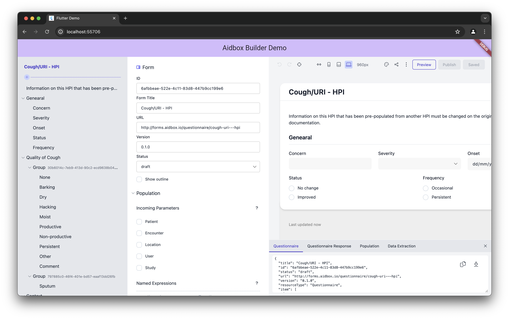

# aidbox-forms-flutter-web

Example of integration Aidbox Forms Builder with Flutter Web



## Usage

```dart
  final String url = 'https://<your-aidbox-instance-host>/ui/sdc#/forms/builder?form=<form-id>&token=<auth-token>';

  @override
  Widget build(BuildContext context) {
    return Scaffold(
      appBar: AppBar(
        backgroundColor: Theme.of(context).colorScheme.inversePrimary,
        title: Text('Aidbox Builder Demo'),
      ),
      body: Center(
        child: AidboxBuilderWidget(url),
      ),
    );
  }
```

## Query parameters
Query parameters that can passed to the builder in fragment part of the url are:
* `form` - optional, either form id or empty string to open builder with blank form.
* `token` - optional, JWT token of authenticated user to be used as bearer token to communicate with aidbox. If token is not provided, builder page is redirected to login page.
* `f` - optional, feature flag, 2 - hide back button  in the top-left corner of the builder page.
