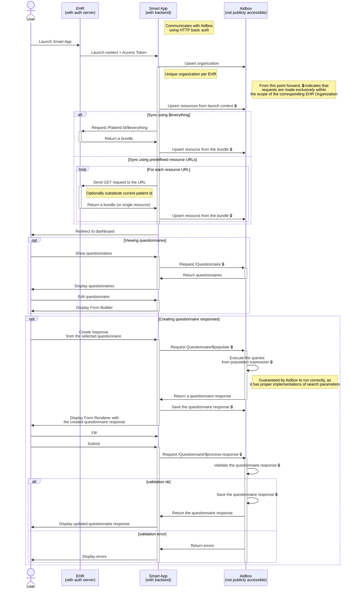

This is a Aidbox Forms Smart Launch project bootstrapped with [Next.js](https://nextjs.org/).

You can use this project as a starting point for building your own Aidbox Forms Smart App. 
It is intentionally kept simple to help you understand how to integrate Aidbox Forms adapt it to your needs.

It includes an implementation of:
- [x] SMART on FHIR Launch sequence on the backend
  - [x] Cookie based session management
- [x] Configuration of Aidbox server
  - [x] Multitenancy via Organization based Access Control
- [x] Client authentication with Aidbox
- [x] FHIR resources synchronization using `$everything`
- [ ] FHIR resources synchronization using predefined resource URLs
- [x] Integration of Aidbox Forms via web components
- [x] Questionnaire CRUD operations
  - [x] Searching questionnaires
  - [x] Viewing questionnaires
  - [x] Creating questionnaire responses
  - [x] Viewing public library
  - [x] Importing questionnaires from public library
  - [x] Editing questionnaires
  - [x] Deleting questionnaires
- [x] Questionnaire response CRUD operations
  - [x] Creating questionnaire responses
    - [x] Pre-populating questionnaire responses
  - [x] Viewing questionnaire responses
  - [x] Editing questionnaire responses
  - [x] Deleting questionnaire responses

[Demo](https://forms-smart-app.aidbox.app)

## Development

First, copy `.env.example` to `.env` and set the correct values:

```bash
cp .env.example .env
```

Obtain license key from [Aidbox](https://aidbox.app) and set it in `AIDBOX_LICENSE` variable.

Then, start aidbox server:

```bash
docker-compose up -d
```

Install dependencies:

```bash
pnpm install
```

Then, run the development server:

```bash
npm run dev
```

Open [http://localhost:3000](http://localhost:3000) with your browser to see the result.

Aidbox server will be available at [http://localhost:8888](http://localhost:8888).


## Interaction Diagram



## Features

1. SMART Launch & Authorization Flow:
  * The app implements SMART on FHIR launch sequence using `/api/launch/authorize` and `/api/launch/ready` endpoints
  * Uses `fhirclient` library for SMART authorization
  * Supports both standalone and EHR launch flows
  * Configured scopes include: openid, fhirUser, profile, offline_access, launch, launch/patient, patient/.rs, user/.rs
  * Client ID is set to "aidbox-forms"
2. Resource Synchronization:
  * After successful authorization, the app syncs FHIR resources from the launch context to Aidbox
  * The sync process includes:
    * Patient data from launch context
    * User data (Practitioner/RelatedPerson)
    * Current encounter if available
    * Additional context resources from token response
    * Patient $everything operation results
  * Resources are synchronized using a FHIR batch bundle with PUT requests
  * Each resource is stored in an organizational compartment in Aidbox
3. Forms Management:
  * Supports FHIR Questionnaire and QuestionnaireResponse resources
  * Provides UI for:
    * Viewing/searching questionnaires
    * Creating/editing questionnaires using a form builder
    * Filling questionnaires
    * Managing questionnaire responses
  * Uses web components from form-builder.aidbox.app for rendering and building forms
  * Supports population of QuestionnaireResponses with launch context data
4. Data Access:
  * Resources are stored in organizational compartments based on the FHIR server URL
  * Implements pagination and search functionality for resources
  * Supports filtering by various attributes (name, gender, title etc.)
  * Handles resource relationships and includes (e.g. QuestionnaireResponse.questionnaire)
5. UI Features:
  * Modern React-based UI with Next.js
  * Responsive sidebar navigation
  * Tabular views with sorting and filtering
  * Form builder and renderer integration
  * Patient context display


The application follows a clean architecture with:

 * Clear separation of server/client code
 * Type-safe FHIR resource handling
 * Error handling and logging
 * Efficient resource synchronization
 * Modern UI components and styling with shadcn/ui

The key integration points are:

1. SMART launch sequence for authorization
2. Resource synchronization with Aidbox
3. Form builder/renderer web components
4. FHIR API interactions for resource management
