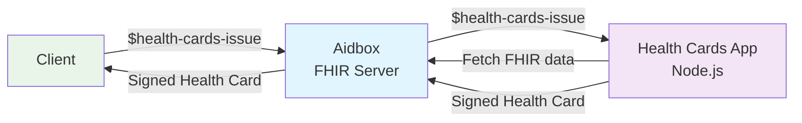

# SMART Health Cards Issue Operation

A minimal TypeScript implementation of the FHIR `$health-cards-issue` operation that integrates with Aidbox to generate SMART Health Cards from patient health data.

## Overview

This project implements the [SMART Health Cards specification](https://hl7.org/fhir/uv/smart-health-cards-and-links/STU1/OperationDefinition-patient-i-health-cards-issue.html) as a FHIR operation. It retrieves patient health data from Aidbox, sanitizes it according to SMART Health Cards requirements, and generates verifiable health cards in JWS format.

## Architecture



**Components:**
- **FHIR Server**: Aidbox with [custom operation routing](https://www.health-samurai.io/docs/aidbox/developer-experience/aidbox-sdk/apps)
- **Application**: Node.js TypeScript backend service - actual implementation of `$health-cards-issue` operation
- **Output**: Cryptographically signed SMART Health Cards (JWS format)

## Quick Start

### Prerequisites

- Docker and Docker Compose
- Node.js 18+ (for development)

### Running the Application

1. **Generate signing keys**:
   ```bash
   npm run generate-keys
   ```


2. **Run docker compose**:
    ```bash
   docker compose up --build
   ```

3. Navigate to [Aidbox UI](http://localhost:8080) and initialize the Aidbox instance.

### Testing Health Cards generation

1. Navigate to  [Aidbox Rest Console](http://localhost:8080/ui/console#/rest)

```http
POST /fhir/Patient/example-patient/$health-cards-issue
Content-Type: application/fhir+json

{
  "resourceType": "Parameters",
  "parameter": [
    {
      "name": "credentialType",
      "valueString": "Immunization"
    },
    {
      "name": "credentialType",
      "valueString": "Observation"
    },
    {
      "name": "_since",
      "valueInstant": "2023-01-01T00:00:00Z"
    },
    {
      "name": "includeIdentityClaim",
      "valueBoolean": false
    }
  ]
}
```

Example response:
```json
{
 "resourceType": "Parameters",
 "parameter": [
  {
   "name": "verifiableCredential",
   "valueString": "eyJhbGciOiJFUzI1NiIsInppcCI6IkRFRiIsImtpZCI6IjcxMTFkNDhkMzNhYmJmZTIifQ.eyJpc3MiOiJodHRwczovL2V4YW1wbGUub3JnL2hlYWx0aC1jYXJkcyIsIm5iZiI6MTc1NTY5OTM5MywidmMiOnsidHlwZSI6WyJodHRwczovL3NtYXJ0aGVhbHRoLmNhcmRzI2hlYWx0aC1jYXJkIiwiaHR0cHM6Ly9zbWFydGhlYWx0aC5jYXJkcyNpbW11bml6YXRpb24iXSwiY3JlZGVudGlhbFN1YmplY3QiOnsiZmhpclZlcnNpb24iOiI0LjAuMSIsImZoaXJCdW5kbGUiOnsicmVzb3VyY2VUeXBlIjoiQnVuZGxlIiwidHlwZSI6ImNvbGxlY3Rpb24iLCJlbnRyeSI6W3sicmVzb3VyY2UiOnsicmVzb3VyY2VUeXBlIjoiUGF0aWVudCIsIm5hbWUiOlt7ImZhbWlseSI6IkRvZSIsImdpdmVuIjpbIkpvaG4iXX1dLCJiaXJ0aERhdGUiOiIxOTgwLTAxLTAxIn19LHsicmVzb3VyY2UiOnsicGF0aWVudCI6eyJyZWZlcmVuY2UiOiJQYXRpZW50L2V4YW1wbGUtcGF0aWVudCJ9LCJwcm90b2NvbEFwcGxpZWQiOlt7InNlcmllcyI6IkNPVklELTE5IFByaW1hcnkgU2VyaWVzIiwiZG9zZU51bWJlclBvc2l0aXZlSW50IjoxLCJzZXJpZXNEb3Nlc1Bvc2l0aXZlSW50IjoyfV0sInNpdGUiOnsiY29kaW5nIjpbeyJjb2RlIjoiTEEiLCJzeXN0ZW0iOiJodHRwOi8vdGVybWlub2xvZ3kuaGw3Lm9yZy9Db2RlU3lzdGVtL3YzLUFjdFNpdGUifV19LCJ2YWNjaW5lQ29kZSI6eyJjb2RpbmciOlt7ImNvZGUiOiIyMDgiLCJzeXN0ZW0iOiJodHRwOi8vaGw3Lm9yZy9maGlyL3NpZC9jdngifV19LCJkb3NlUXVhbnRpdHkiOnsiY29kZSI6Im1MIiwidW5pdCI6Im1MIiwidmFsdWUiOjAuMywic3lzdGVtIjoiaHR0cDovL3VuaXRzb2ZtZWFzdXJlLm9yZyJ9LCJyb3V0ZSI6eyJjb2RpbmciOlt7ImNvZGUiOiJJTSIsInN5c3RlbSI6Imh0dHA6Ly90ZXJtaW5vbG9neS5obDcub3JnL0NvZGVTeXN0ZW0vdjMtUm91dGVPZkFkbWluaXN0cmF0aW9uIn1dfSwicmVzb3VyY2VUeXBlIjoiSW1tdW5pemF0aW9uIiwicmVjb3JkZWQiOiIyMDIzLTAzLTE1IiwicHJpbWFyeVNvdXJjZSI6dHJ1ZSwic3RhdHVzIjoiY29tcGxldGVkIiwibG90TnVtYmVyIjoiQUJDMTIzIiwib2NjdXJyZW5jZURhdGVUaW1lIjoiMjAyMy0wMy0xNSIsImV4cGlyYXRpb25EYXRlIjoiMjAyNC0xMi0zMSIsInBlcmZvcm1lciI6W3siYWN0b3IiOnsiZGlzcGxheSI6IkRyLiBKYW5lIFNtaXRoLCBNRCJ9LCJmdW5jdGlvbiI6eyJjb2RpbmciOlt7ImNvZGUiOiJBUCIsInN5c3RlbSI6Imh0dHA6Ly90ZXJtaW5vbG9neS5obDcub3JnL0NvZGVTeXN0ZW0vdjItMDQ0MyJ9XX19XX19LHsicmVzb3VyY2UiOnsiY2F0ZWdvcnkiOlt7ImNvZGluZyI6W3siY29kZSI6ImxhYm9yYXRvcnkiLCJzeXN0ZW0iOiJodHRwOi8vdGVybWlub2xvZ3kuaGw3Lm9yZy9Db2RlU3lzdGVtL29ic2VydmF0aW9uLWNhdGVnb3J5In1dfV0sInJlc291cmNlVHlwZSI6Ik9ic2VydmF0aW9uIiwiZWZmZWN0aXZlRGF0ZVRpbWUiOiIyMDIzLTAzLTEwIiwic3RhdHVzIjoiZmluYWwiLCJjb2RlIjp7ImNvZGluZyI6W3siY29kZSI6Ijk0NTAwLTYiLCJzeXN0ZW0iOiJodHRwOi8vbG9pbmMub3JnIn1dfSwidmFsdWVDb2RlYWJsZUNvbmNlcHQiOnsiY29kaW5nIjpbeyJjb2RlIjoiMjYwMzg1MDA5Iiwic3lzdGVtIjoiaHR0cDovL3Nub21lZC5pbmZvL3NjdCJ9XX0sInN1YmplY3QiOnsicmVmZXJlbmNlIjoiUGF0aWVudC9leGFtcGxlLXBhdGllbnQifSwicGVyZm9ybWVyIjpbeyJkaXNwbGF5IjoiRXhhbXBsZSBMYWIifV19fV19fX19.3WVpGCl8qD3E2apBLma1OZ36DyLsS_AwhOaZWdQ0iu4rMkt2zuLj5o4V_xWL-Tv5175H7-gWbx6bqrmM3Foi3w"
  }
 ]

```

2. Extract the `valueString`

### JWKS Endpoint
```http
GET /.well-known/jwks.json
```

Returns the public key set for verifying health card signatures.

## Available Scripts

- `npm run dev` - Start development server with hot reload
- `npm run build` - Build for production
- `npm run start` - Start production server
- `npm run test` - Run tests
- `npm run lint` - Run ESLint with auto-fix
- `npm run generate-keys` - Generate new signing keys

## Configuration

Create a `.env` file:

```bash
# SMART Health Cards Configuration
JWT_ISSUER_ID=https://your-domain.com/issuer
JWT_PRIVATE_KEY_PATH=./keys/private-key.pem
JWT_PUBLIC_KEY_PATH=./keys/public-key.pem
JWT_KID=auto-generated

# Aidbox Configuration
AIDBOX_BASE_URL=http://localhost:8080
AIDBOX_CLIENT_ID=basic
AIDBOX_CLIENT_SECRET=secret

# Application Configuration
APP_PORT=3000
NODE_ENV=development
```

## SMART Health Cards Compliance

This implementation follows the SMART Health Cards specification:

- **JWS Format**: ES256 algorithm signatures
- **Data Minimization**: Removes non-essential fields (id, meta, text, display)
- **FHIR Bundle**: Collection-type bundles with patient and clinical resources
- **JWKS Endpoint**: Public key discovery for verification
- **Credential Types**: Supports Immunization and Observation resources

## Project Structure

```
src/
├── handlers/          # FHIR operation handlers
├── services/          # Core business logic
│   ├── bundle-builder.ts    # FHIR bundle creation & sanitization
│   ├── fhir-client.ts       # Aidbox API client
│   ├── health-card.ts       # Health card generation
│   └── jwks.ts              # JWKS service
├── types/             # TypeScript definitions
├── utils/             # Shared utilities
│   ├── crypto.ts            # JWT signing
│   ├── key-utils.ts         # Key ID generation
│   └── credential-utils.ts  # Credential validation
└── server.ts          # Express application

scripts/
└── generate-keys.ts   # Cryptographic key generation
```

## Dependencies

**Runtime:**
- `express` - Web server
- `axios` - HTTP client for Aidbox API
- `jose` - JWT/JWS operations
- `cors` - CORS middleware
- `dotenv` - Environment configuration

**Development:**
- `typescript` - Type checking
- `eslint` - Code linting
- `jest` - Testing framework
- `nodemon` - Development server


```json


```
