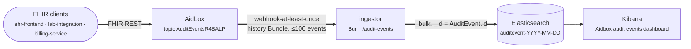
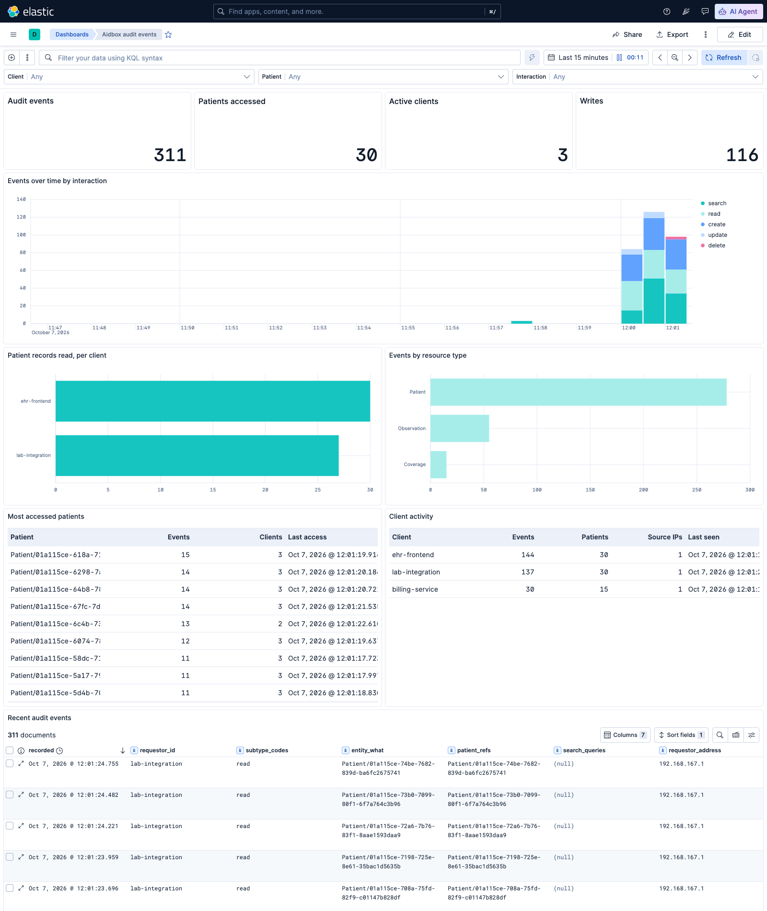

# Aidbox Audit Events → Elasticsearch → Kibana

Ship every Aidbox audit event to Elasticsearch and explore it in a Kibana dashboard. The pipeline is one small [Bun](https://bun.sh) service with no dependencies.

Aidbox publishes FHIR R4 `AuditEvent`s (IHE BALP profiles) on a built-in topic, [`AuditEventsR4BALP`](https://www.health-samurai.io/docs/aidbox/tutorials/security-access-control-tutorials/how-to-subscribe-to-audit-events#the-audit-events-topic). You subscribe a webhook destination to that topic. Aidbox then POSTs batches of events to the ingestor, and the ingestor bulk-indexes them into daily `auditevent-*` indices.





## Run it

Requires Docker and [Bun](https://bun.sh) (Bun is only needed for the traffic generator).

```bash
docker compose up -d
```

1. Open http://localhost:8080 and activate Aidbox ("Continue with Aidbox account"). Compose then loads `init-bundle.json`, which creates the destination, three demo clients and an access policy for them.
2. Generate traffic. The generator runs for about 80 seconds so you can watch the dashboard fill in:

   ```bash
   bun run scripts/generate-traffic.ts
   ```
3. Open the dashboard at http://localhost:5601/app/dashboards#/view/aidbox-audit-dashboard.

The `kibana-setup` container imports the dashboard on start and then exits. To re-import after you edit `kibana/setup.ts`, run `docker compose run --rm kibana-setup`.

| Service | URL |
|---|---|
| Aidbox | http://localhost:8080 (`admin` / `d6Tj_QnuZj`, client `root` / `uBqQjkMz7f`) |
| Kibana | http://localhost:5601 |
| Elasticsearch | http://localhost:9200 |
| Ingestor | http://localhost:3000/health |

## How it works

### 1. Subscribe to the audit topic

The topic is built in, so you don't create an `AidboxSubscriptionTopic`. Audit events start being produced once a destination subscribes to it. The destination is defined in `init-bundle.json`:

```json
{
  "resourceType": "AidboxTopicDestination",
  "id": "audit-to-elasticsearch",
  "kind": "webhook-at-least-once",
  "topic": "http://health-samurai.io/fhir/core/StructureDefinition/AuditEventsR4BALP",
  "content": "full-resource",
  "parameter": [
    { "name": "endpoint", "valueUrl": "http://ingestor:3000/audit-events" },
    { "name": "header", "valueString": "Authorization: Bearer audit-webhook-token" },
    { "name": "maxMessagesInBatch", "valueUnsignedInt": 100 },
    { "name": "timeout", "valueUnsignedInt": 30 }
  ]
}
```

Check delivery with `GET /fhir/AidboxTopicDestination/audit-to-elasticsearch/$status`.

### 2. Ingest ([`ingestor/src`](ingestor/src))

- **`server.ts`**: `Bun.serve` with `POST /audit-events`. It checks the bearer token, takes the `AuditEvent` entries from the history Bundle (it skips entry 0, the `AidboxSubscriptionStatus`), and bulk-indexes them.
- **`elasticsearch.ts`**: installs the index template on start and writes with `_bulk`. Two choices make at-least-once delivery safe:
  - **`_id` is the `AuditEvent.id`**, so a redelivered event overwrites itself instead of creating a duplicate.
  - **The index name comes from `recorded`**, not from the time of ingestion, so a redelivery always lands in the same daily index.

  The ingestor answers 200 only after Elasticsearch has accepted the batch. If Elasticsearch is down or returns 429/5xx, the ingestor answers 503. Aidbox keeps the events queued and retries. To see this, stop `elasticsearch`, make a few requests, start it again, and the events appear. A document Elasticsearch rejects as malformed (4xx) is logged and acknowledged, because retrying it would never succeed.
- **`mapping.ts`**: the index template (described in the next section).
- **`rollups.ts`**: computes the flat Kibana fields.

### 3. Index mapping, plus roll-ups

The `AuditEvent` part of the template mirrors the FHIR structure:

- the full FHIR resource is kept in `_source`, with `dynamic: false`
- `agent`, `entity`, `subtype` and the codings are `nested`
- `fts_text` is fed by `copy_to` from agent and entity display names, network addresses and type codes
- the index is sorted by `recorded desc`, with daily `auditevent-*` indices

Kibana Lens can't aggregate on `nested` fields. So the ingestor adds flat keyword **roll-ups** next to the resource:

| Field | Derived from |
|---|---|
| `requestor_id`, `requestor_address` | the agent with `requestor: true`, i.e. the calling client. The other agent is always Aidbox itself. |
| `agent_who`, `agent_names`, `agent_altIds`, `agent_network_addresses` | all agents |
| `entity_what`, `entity_types` | entity references without the `_history/N` suffix, plus their resource type. The BALP `XrequestId` entity is excluded. |
| `patient_refs` | entities with object-role *Patient*, references to `Patient/*`, and `Patient/…` or `patient=` parameters in a search query |
| `search_queries` | `entity.description` of the *Query* entity |
| `request_id` | the BALP `XrequestId` entity, which you can correlate with Aidbox logs |
| `type_code`, `subtype_codes`, `outcome_label`, `source_observer_refs` | the corresponding codes |

 This example leaves roll-ups in `_source` so Kibana Discover can show them as columns. To get pure FHIR documents back, strip those top-level fields, or add them to `_source.excludes` in `mapping.ts`.

### 4. Dashboard ([`kibana/setup.ts`](kibana/setup.ts))

The data view, the Lens panels and the dashboard are generated in TypeScript and imported through the saved objects API, so you can review and edit them as code.

| Panel | Answers |
|---|---|
| Client / Patient / Interaction controls | "Who touched patient X?" and "What did client Y do?" |
| Audit events, Patients accessed, Active clients, Writes | Headline volume |
| Events over time by interaction | Traffic shape: create / read / search / update / delete |
| Patient records read, per client | Which systems open patient charts |
| Events by resource type | What is being accessed |
| Most accessed patients | Top patient charts, how many clients touched each, and last access |
| Client activity | Per-client event and patient counts, source IPs, and last seen |
| Recent audit events | Raw event stream: requestor, interaction, target, patient, query, IP |

The generator ends with a deliberate anomaly: `lab-integration`, which normally only posts lab results, reads every patient chart. You can spot it in *Patient records read, per client* and at the end of the timeline. Filter on Client = `lab-integration` to drill in.

## Things to know

- **Requires Aidbox 2609 or later**, which provides the built-in topic. Compose uses `healthsamurai/aidboxone:edge`.
- **This is a demo cluster.** Elasticsearch security is off, the cluster is a single node with 0 replicas, and there's no ILM. For retention, add an ILM policy to the template.
- **The webhook token** is a shared constant in `init-bundle.json` and `docker-compose.yaml`. Change both together.

## Tests

```bash
cd ingestor && bun test
```

The roll-up tests use real `AuditEvent`s captured from Aidbox, in `ingestor/test/fixtures`.

## Clean up

```bash
docker compose down -v
```
