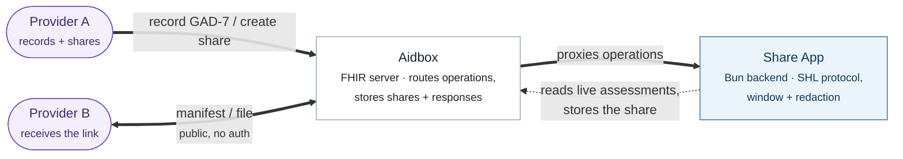
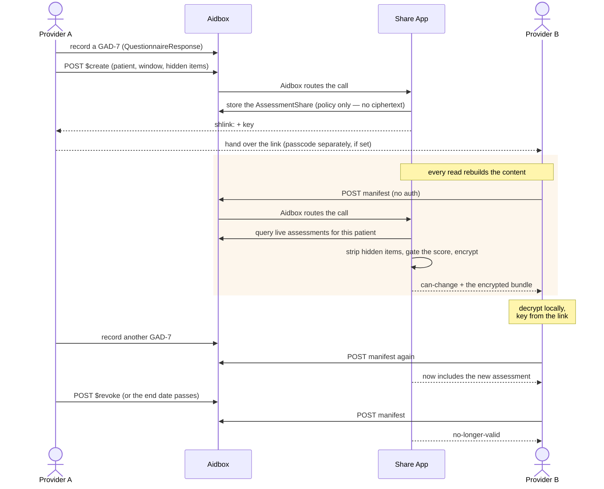
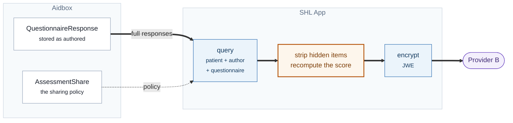
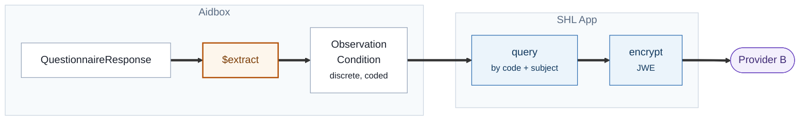
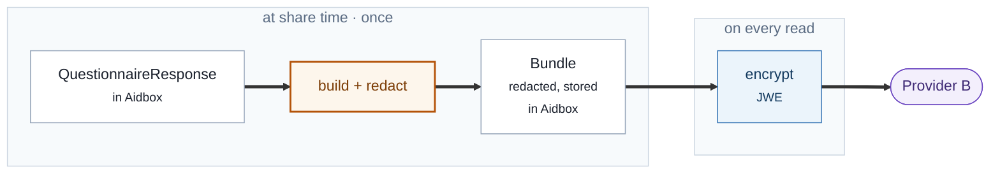
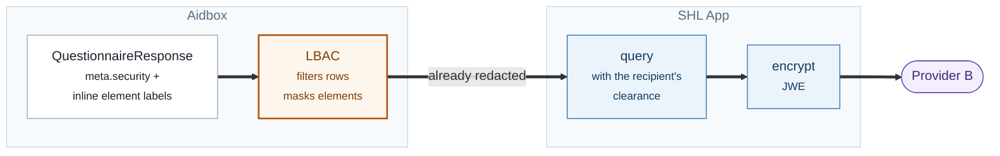

# SMART Health Links: Time-Bounded Assessment Sharing

A small TypeScript ([Bun](https://bun.sh)) implementation of [SMART Health Links (SHL)](https://hl7.org/fhir/uv/smart-health-cards-and-links/STU1/links-specification.html) on Aidbox. One provider organization shares a patient's GAD-7 assessment history with another organization — for a fixed window, with chosen questions held back — and can close the sharing early.

> **There are two SHL examples in this repo.** [`smart-health-link`](../smart-health-link/) shares a **snapshot**: it encrypts one finished result (an eligibility response) at mint time, and is the shorter read if you want the bare protocol. This one shares a **live, policy-driven view** — content is rebuilt and re-redacted on every read, which is what makes a time window, automatic expiry, and immediate revocation work. Same protocol, opposite ends of the "fixed content vs. evolving content" tradeoff.

## Use case

A behavioral-health practice has been seeing a patient for months and has a run of GAD-7 assessments on file. They refer the patient to a psychiatry group, a separate organization with its own records system and no access to theirs.

From the referring practice's side:

1. **They record assessments** as they normally would — each GAD-7 becomes a FHIR `QuestionnaireResponse`.
2. **They grant access** to the receiving organization: this patient, these dates, and a tick-box for any question that should stay private.
3. **They get a link** to hand over. Nothing else to coordinate.
4. **They can watch and close it.** They see when the recipient actually read it, and can end the sharing before the date if the referral falls through.

From the receiving organization's side: they open the link and see the history, with withheld questions marked as withheld rather than silently missing. Assessments the referring practice completes later show up the next time they open it. On the end date the link stops working.

**What makes that work: nothing is encrypted when the link is created.** The share stores only a *policy* — which patient, which window, which items. Every time the recipient opens the link, the server re-queries the live assessments, re-applies the redaction, and encrypts the result fresh. Three properties follow from that single choice:

| Requirement | Why it holds |
|---|---|
| New assessments appear automatically | Each read re-runs the query, so anything added since is simply included |
| The end date closes access on its own | The window is checked at read time — no scheduled job, nothing to clean up |
| An early close takes effect at once | There is no pre-encrypted copy sitting on the server to claw back |
| Tightening what's shared applies retroactively | Redaction runs on every read, so a link already sent honors the new policy |

### Why this pattern, and not a fax

SMART Health Links exist because the alternative is the patient re-entering their history on paper. That is the whole premise of **[Kill the Clipboard](https://killtheclipboard.com/)** — *"Stop filling out the same forms. Share your records from your phone."* — which asks patients to carry their records as a QR code and hand that over at intake instead of a pen.

The same effort from the industry side is the [CMS Health Tech Ecosystem pledge](https://www.cms.gov/health-tech-ecosystem), under which ~60 health systems, EHR vendors and technology companies committed in 2025 to *accepting* that data — specifically via QR codes and SMART Health Cards / Links carrying FHIR. Also worth a look: [Leavitt Partners' Kill the Clipboard initiative](https://leavittpartners.com/kill-the-clipboard/) (industry, CMS-aligned but separate) and [`kill-the-clipboard`](https://github.com/vintasoftware/kill-the-clipboard), an open-source TypeScript implementation of both specs.

Those are all about the **patient** carrying the link. This example is the other half of the same picture: the identical `shlink:` mechanism, minted by one organization for another, with a time limit and fields held back. If a clinic can accept a QR code from a patient, it can accept one from a referring practice — and the receiving end of this demo is the same code either way.

## Architecture



**Components:**
- **FHIR Server**: Aidbox with [custom operation routing](https://www.health-samurai.io/docs/aidbox/app-development/aidbox-sdk/apps) and an `AssessmentShare` [custom resource](https://www.health-samurai.io/docs/aidbox/tutorials/artifact-registry-tutorials/custom-resources).
- **Application**: Bun/TypeScript service implementing share creation, revocation, and the SHL manifest and file operations.

**Output:** the content behind the link is a FHIR searchset `Bundle` of redacted `QuestionnaireResponse`s, encrypted as a JWE (`alg: dir`, `enc: A256GCM`) under the SHL key.

## Flow



## Where the work could live instead

This example puts the query and the field filtering in the app. That is one of four reasonable splits between the FHIR server and the SHL app, and the choice is not obvious — it trades enforcement strength against how much you have to model up front. The diagrams below are the alternatives, roughly in order of how much responsibility moves into Aidbox.

Common to all four: the app always owns the SHL protocol itself (minting the `shlink:`, the manifest lifecycle, the passcode, the file tokens, JWE encryption). What moves is **who decides what the recipient may see**.

The diagrams share a vocabulary, so the same shape means the same thing in each: **white** boxes are data at rest, **blue** are steps the app runs, and the **amber, heavier-bordered** box is where the withholding is actually enforced. Watching that amber box move from the app into Aidbox across the four diagrams *is* the comparison.

### 1. App queries and filters — what this repo does



The server is a plain store; every decision is app code. **Cheapest to build and the easiest to reason about** — the redaction rules, including the score-leak fix, are a single readable function. The cost is that the app reads unredacted data and is the only thing standing between it and the recipient: a bug in `redactResponse` is a disclosure. Filtering also can't be reused by any other client.

### 2. Server extracts discrete resources, the app shares those



Aidbox's [`$extract`](https://www.health-samurai.io/docs/aidbox/reference/aidbox-forms-reference/fhir-sdc-api) (Forms module; Observation-based and Definition-based extraction) turns a response into discrete resources. Sharing those instead means the recipient gets data that **drops straight into their chart** rather than a form they must read — far more useful clinically, and the natural fit if they want to trend a score alongside their own observations.

Redaction changes character, though: the unit is no longer a `linkId` but a resource, so you select by code instead of item. Two traps come with it. Extracted resources can **reconstitute what you withheld** — hide an item but share the `Observation` derived from it and the answer walks out the back door; suppress the score but share a `Condition` of "severe anxiety" and the band leaks it. And to hide "everything derived from item 4" you need provenance recorded at extraction time (`itemExtractionContext`, or a `Provenance`/`derivedFrom` link). Without that, per-item redaction here is unenforceable.

### 3. Prepare the Bundle in advance and store it



Redaction runs once, at share time, and the result is persisted. **Reads get cheap and auditable** — you can point at the exact bytes a recipient was served, which matters for a disclosure log or a signed credential (a [SMART Health Card](https://hl7.org/fhir/uv/smart-health-cards-and-links/STU1/) has to be signed over fixed content anyway).

But it gives up the properties this use case asked for. A new assessment does **not** appear — someone must rebuild and re-store it. Tightening what's shared does **not** apply retroactively, because a copy already exists. Revocation stops serving the Bundle but the plaintext is still on disk. Choose this when the share is a snapshot ("the record as of the referral date"); avoid it when it must stay live.

### 4. Server enforces it with Label-based Access Control



[LBAC](https://www.health-samurai.io/docs/aidbox/access-control/authorization/label-based-access-control) (`BOX_SECURITY_LBAC_ENABLED`) tags resources via `meta.security` and the requester via JWT `scope`, then enforces in two phases: non-matching rows are filtered **in Postgres** so they never reach the app, and individual elements are masked when the resource carries `PROCESSINLINELABEL` and the elements carry DS4P inline security labels — replaced with a `masked` data-absent-reason, the same marker this app writes by hand.

### Choosing

| | Redaction enforced by | Stays live | Retroactive policy change | Reusable by other clients | Cost |
|---|---|---|---|---|---|
| **1. App filters** | app code | yes | yes | no | lowest |
| **2. Server extracts** | app code, over discrete resources | yes | needs provenance | resources are | medium |
| **3. Pre-built Bundle** | app code, once | **no** | **no** | the Bundle is | low |
| **4. LBAC** | the server | yes | yes | **yes** | highest |

This repo uses **1** because the point is to make the sharing mechanics legible in readable code. For production, **4** is where the field-level rules belong — the app cannot leak what it never receives — with **2** layered in when the recipient wants data for their chart rather than a form to read. Reach for **3** only when the share is deliberately a snapshot.

## Two things worth calling out

### Withheld, not missing

Silently dropping a question is worse than saying it was dropped: the receiving clinician can't tell "the patient didn't answer" from "the sender wouldn't show me." So a hidden item keeps its `linkId` and question text, loses its answer, and gains a `masked` data-absent-reason:

```json
{
  "linkId": "gad7-q4",
  "text": "Trouble relaxing",
  "extension": [
    { "url": "http://example.org/fhir/StructureDefinition/data-absent-reason",
      "valueCode": "masked" }
  ]
}
```

### The score is a back door

A GAD-7 total is the sum of its seven scored items. Hide one item but publish the total, and the hidden answer is exactly `total − sum(visible)` — the redaction is undone by arithmetic. So:

- with `shareScore: false`, no score is sent at all;
- with `shareScore: true` **and** any scored item hidden, the score is recomputed from the *visible* items only, so it can never act as an oracle.

See `src/services/redaction.ts`.

## Aidbox resources

The [init bundle](init-bundle/bundle.json) provisions the configuration and demo data at startup. The flow creates the rest at runtime.

| Resource | Created | Why |
|----------|---------|-----|
| `Client/share-client` | init bundle | The M2M client the Bun app uses to call Aidbox's FHIR API (Basic auth). |
| `AccessPolicy/share-client-policy` | init bundle | Grants `share-client` access to Aidbox (`allow` engine). |
| `StructureDefinition/AssessmentShare` | init bundle | Defines the `AssessmentShare` [custom resource](https://www.health-samurai.io/docs/aidbox/tutorials/artifact-registry-tutorials/custom-resources): one sharing grant — parties, patient, window, hidden items, passcode state, file tokens, access log. |
| `App/share-app` | init bundle | Registers the app and routes the four operations. |
| `Questionnaire/gad7` + `CodeSystem` + two `ValueSet`s | init bundle | The GAD-7 instrument. The form renderer reads this resource directly, so the instrument is defined once here rather than in code. Its items carry inline `answerOption` (see "Notes & scope"); the `CodeSystem`/`ValueSet` remain the terminology of record. |
| `Organization/provider-a`, `Organization/provider-b` | init bundle | The sharing and receiving organizations. |
| `Patient/patient-jane-roe` | init bundle | A demo patient to record assessments against. |
| `QuestionnaireResponse/{id}` | runtime, one per assessment | A completed GAD-7, stamped with the sharing organization as `source`. |
| `AssessmentShare/{id}` | runtime, one per share | The grant: who may read what, when, and with which items withheld. |

## Endpoints

All four are Aidbox App operations, proxied to the Bun service. Manifest and file are **public** (bound to an `allow` policy); create and revoke are authenticated.

| Operation | Method | Path | Auth | Purpose |
|-----------|--------|------|------|---------|
| `share-create` | POST | `/share-app/shares/$create` | required | Grant time-bounded access, mint a `shlink:` |
| `share-revoke` | POST | `/share-app/shares/{shareId}/$revoke` | required | Close a share before its end date |
| `share-manifest` | POST | `/share-app/manifest/{shareId}` | public | SHL manifest request |
| `share-file` | GET | `/share-app/file/{fileId}` | public | Short-lived encrypted file fetch |

The Bun app also serves the demo UI directly (not via Aidbox) on port 3100: `GET /` plus a handful of unauthenticated `/demo/*` routes the page uses; see "Testing the flow".

## Quick Start

### Prerequisites
- Docker and Docker Compose
- [Bun](https://bun.sh) 1.x (for local development)

### Running the application

1. **Create .env file** (optional; defaults match `docker-compose.yaml`):
   ```bash
   cp .env.example .env
   ```

2. **Run docker compose**:
   ```bash
   docker compose up --build
   ```

3. **Initialize Aidbox**: navigate to the [Aidbox UI](http://localhost:8080) and [activate the instance](https://www.health-samurai.io/docs/aidbox/getting-started/run-aidbox-locally#activate-your-aidbox-instance). The init bundle registers the client, the `AssessmentShare` custom resource, the `share-app` App, the GAD-7 questionnaire, and the demo organizations and patient.

4. **Open the app**: [http://localhost:3100](http://localhost:3100). Minted links open it prefilled.

### Local development (without Docker for the app)

```bash
bun install
bun run dev      # watch mode
```

## Testing the flow

### The whole use case in the browser (recommended)

Open **[http://localhost:3100](http://localhost:3100)**. Four tabs walk the two organizations' halves:

1. **Complete a GAD-7.** The form is rendered by [`@formbox/renderer`](https://github.com/HealthSamurai/formbox-renderer) from the `Questionnaire/gad7` resource in Aidbox — the same renderer [HealthSamurai/phr](https://github.com/HealthSamurai/phr) uses. Answer the seven scored items (the eighth, functional impairment, is standard but not scored) and submit; it lands in Aidbox as a `QuestionnaireResponse` attributed to the sharing organization. Save a couple so there's a history.
2. **Share it.** Pick the patient and the receiving organization, set the window, and tick any question to hold back. Optionally set a passcode (delivered out-of-band) and decide whether the total score travels. You get a `shlink:` back.
3. **Manage shares.** Every grant with its window, what it withholds, and when the recipient read it — plus **Close now** to end one early.
4. **Open a link.** The real receiver half: paste the `shlink:`, and the page decodes it, polls the manifest, fetches the ciphertext, and decrypts it with WebCrypto. Withheld questions show as *withheld*; a suppressed score shows as *score withheld*. Expand **Behind the scenes** to see each HTTP call and its live response.

Three things worth trying once it's running:

- **Watch the share stay live.** Open the link, go back to tab 1, save another assessment, then reopen the link — the new one is there. Nothing was re-minted.
- **Watch it close.** Create a share ending two minutes out, then reopen the link after. Or hit **Close now** and reopen immediately.
- **Watch the score close the leak.** Share with question 4 hidden and the score on, and compare the total against the visible answers — it sums only what you can see.

> The UI's first three tabs call unauthenticated `/demo/*` routes so the browser holds no Aidbox credentials. In production those are the authenticated `share-create` / `share-revoke` operations, triggered from the sharing organization's own system.

### The same flow at the API level

Use the [Aidbox REST Console](http://localhost:8080/u/rest) or `curl`.

#### 1. Record a GAD-7

```http
POST /fhir/QuestionnaireResponse
Content-Type: application/fhir+json

{
  "resourceType": "QuestionnaireResponse",
  "questionnaire": "http://example.org/fhir/Questionnaire/gad7",
  "status": "completed",
  "subject": { "reference": "Patient/patient-jane-roe" },
  "author": { "reference": "Organization/provider-a" },
  "authored": "2026-07-01T10:00:00Z",
  "item": [
    { "linkId": "gad7-q1", "text": "Feeling nervous, anxious, or on edge",
      "answer": [{ "valueCoding": {
        "system": "http://example.org/fhir/CodeSystem/gad7-frequency",
        "code": "nearly-every-day", "display": "Nearly every day" } }] }
  ]
}
```

`author` is what scopes a share to one organization's own assessments — not `source`, which FHIR restricts to a person (`Patient | Practitioner | PractitionerRole | RelatedPerson`). The spec is explicit that responses "authored by other collections of people must use Organization".

#### 2. Create a share

```http
POST /share-app/shares/$create
Content-Type: application/fhir+json

{
  "resourceType": "Parameters",
  "parameter": [
    { "name": "patient",               "valueString": "Patient/patient-jane-roe" },
    { "name": "recipientOrganization", "valueString": "Organization/provider-b" },
    { "name": "recipientDisplay",      "valueString": "Riverside Psychiatry Group" },
    { "name": "end",                   "valueString": "2026-09-01T00:00:00Z" },
    { "name": "hiddenItems",           "valueString": "gad7-q4,gad7-q8" },
    { "name": "shareScore",            "valueString": "true" }
  ]
}
```

Response:
```json
{
  "resourceType": "Parameters",
  "parameter": [
    { "name": "shareId",     "valueString": "3f9a..." },
    { "name": "shlink",      "valueString": "shlink:/eyJ1cmwiOiJodHRw..." },
    { "name": "manifestUrl", "valueString": "http://localhost:8080/share-app/manifest/3f9a..." },
    { "name": "expiresAt",   "valueString": "2026-09-01T00:00:00.000Z" }
  ]
}
```

`start` defaults to now; `end` is required and becomes the link's `exp`.

#### 3. Poll the manifest (no auth required)

```http
POST /share-app/manifest/{shareId}
Content-Type: application/json

{ "recipient": "Riverside Psychiatry Group" }
```

While the window is open:
```json
{
  "status": "can-change",
  "files": [
    { "contentType": "application/fhir+json", "embedded": "<JWE compact serialization>" }
  ]
}
```

`can-change` is the honest status for a live share — more assessments may still arrive. Once the window closes (end date passed, or revoked):
```json
{ "status": "no-longer-valid", "files": [] }
```

If you send `embeddedLengthMax` smaller than the JWE, the manifest returns a short-lived `location` URL instead:
```http
GET /share-app/file/{fileId}    # returns the JWE as application/jose
```

#### 4. Close it early

```http
POST /share-app/shares/{shareId}/$revoke
```

The next manifest poll resolves to `no-longer-valid`, and any outstanding `location` URLs return `410 Gone`.

#### 5. Decrypt the contents

```ts
import { decodeShlink } from "./src/utils/shl-encode.ts";
import { decryptJwe } from "./src/utils/crypto.ts";

const payload = decodeShlink(shlink);          // { url, key, exp, flag: "L", label, v }
const bundle = JSON.parse(await decryptJwe(jwe, payload.key));
// -> Bundle of redacted QuestionnaireResponses
```

The bundle carries the terms it was produced under, so the constraints travel with the data:

```json
{
  "resourceType": "Bundle",
  "type": "searchset",
  "total": 3,
  "extension": [
    { "url": "http://example.org/fhir/StructureDefinition/share-window",
      "extension": [
        { "url": "start", "valueInstant": "2026-07-29T10:00:00.000Z" },
        { "url": "end",   "valueInstant": "2026-09-01T00:00:00.000Z" },
        { "url": "sharedBy",   "valueString": "Organization/provider-a" },
        { "url": "sharedWith", "valueString": "Riverside Psychiatry Group" }
      ] },
    { "url": "http://example.org/fhir/StructureDefinition/share-redaction",
      "extension": [
        { "url": "withheldItem",  "valueString": "gad7-q4" },
        { "url": "withheldItem",  "valueString": "gad7-q8" },
        { "url": "scoreWithheld", "valueBoolean": false }
      ] }
  ],
  "entry": [ /* QuestionnaireResponses, hidden items masked */ ]
}
```

## Project layout

```
src/
├── server.ts                       # Bun.serve; dispatches Aidbox operations, bundles + serves the UI
├── app.html                        # browser app: share builder, dashboard, receiver (no build)
├── forms/
│   └── intake.tsx                  # React island: GAD-7 rendered by @formbox/renderer
├── handlers/
│   └── share.ts                    # create / revoke / manifest / file handlers
├── services/
│   ├── fhir-client.ts              # wraps @health-samurai/aidbox-client (Basic auth)
│   ├── share-store.ts              # AssessmentShare custom-resource persistence
│   ├── assessment-service.ts       # GAD-7 capture + live query, score computation
│   ├── redaction.ts                # item masking + score-leak prevention
│   ├── share-content.ts            # builds the shared Bundle on every read
│   └── share-service.ts            # SHL protocol engine: window, passcode, tokens, throttle
├── types/
│   ├── config.ts                   # env-driven config
│   ├── operation.ts                # Aidbox operation request envelope
│   ├── shl.ts                      # SHL payload / manifest types
│   ├── fhir.ts                     # minimal FHIR shapes the app touches
│   ├── gad7.ts                     # the GAD-7 instrument + scoring
│   └── assessment-share-resource.ts # AssessmentShare custom resource shape
└── utils/
    ├── crypto.ts                   # key generation + JWE encrypt/decrypt (jose)
    └── shl-encode.ts               # shlink: encode/decode
```

## Protocol hardening

The example also implements the security-sensitive plumbing of the SHL spec, the parts you don't want every integrator reimplementing:

- **Passcode (`P` flag)**: pass a `passcode` and the link carries `flag: "LP"`. The manifest then requires it. A missing one returns `401 { "message": "Passcode required" }`, a wrong one returns `401 { "remainingAttempts": N }`. The attempt counter is a **lifetime** total persisted on the `AssessmentShare` (and decremented before responding), so it holds up against parallel guessing. Once it hits zero the share locks, and even the correct passcode then resolves to `no-longer-valid`.
- **Short-lived `location` URLs**: when the manifest hands back a `location` instead of an `embedded` file, it mints a per-request token with an expiry (`SHL_FILE_TOKEN_TTL_SECONDS`, default 60s; the spec allows ≤ 1 hour). Fetching after it expires returns `410 Gone` — and so does fetching after the *share* closes, since revocation has to invalidate URLs already handed out. Because content is rebuilt per read, each token stores the exact ciphertext its manifest advertised.
- **Poll throttling**: polling one share's manifest faster than `SHL_MANIFEST_MIN_INTERVAL_SECONDS` returns `429` with a `Retry-After` header, which the UI honors.
- **Access log**: each resolved poll appends the self-declared recipient, the time, and how many assessments were visible — the accountability half of a time-bounded grant, surfaced in the "Manage shares" tab.

Tunable via env (see `.env.example`): `SHL_PASSCODE_MAX_ATTEMPTS`, `SHL_FILE_TOKEN_TTL_SECONDS`, `SHL_MANIFEST_MIN_INTERVAL_SECONDS`, `SHARE_DEFAULT_WINDOW_DAYS`, `SHARE_SOURCE_ORGANIZATION`.

## Notes & scope

- **Flags**: uses `L` (long-term, since contents evolve while the window is open) and optionally `P` (passcode). It does not implement `U` (direct file). A share is never `finalized`; it goes from `can-change` straight to `no-longer-valid`.
- **Key storage**: the SHL key is persisted on the `AssessmentShare` so each manifest poll can encrypt a freshly built bundle. In production you'd avoid long-term key storage. This is the one deliberate simplification, called out because it's the central security tradeoff of the design.
- **Bearer link**: the link itself is the credential — `recipientOrganization` is recorded for the audit trail, not verified. Anyone holding the link (and passcode, if set) can read it within the window. Binding a share to an authenticated recipient identity would mean SMART on FHIR rather than SHL.
- **Inline `answerOption` rather than `answerValueSet`**: the GAD-7's items carry their answer choices inline. Aidbox's hybrid terminology engine returned an empty expansion for the stored `ValueSet`s (the same `compose` expanded correctly when posted inline), and `ValueSet/$expand` needs credentials the browser doesn't hold. Inline options remove both the round trip and the auth problem. The `CodeSystem`/`ValueSet` resources stay in the init bundle as the terminology of record.
- **The form needs a bundler; the rest of the UI doesn't.** `@formbox/renderer` ships ESM with bare specifiers (react, mobx, fhirpath, ucum-lhc), so the intake tab is compiled by `Bun.build()` at server startup into `/assets/intake.js` (~2.4 MB) and `/assets/intake.css`. There's still no build command to run — `bun src/server.ts` does it. The receiver view stays hand-written because rendering *redacted* responses (showing withheld items as withheld) is exactly what a form renderer doesn't do.
- **Out of scope**: real-world consent modelling (`Consent` resources), recipient identity verification, `location` single-use enforcement (only expiry and window are enforced), key rotation, sharing more than one instrument per share, and SDC `$extract` (the renderer produces a `QuestionnaireResponse`; nothing maps it onto other resources).
