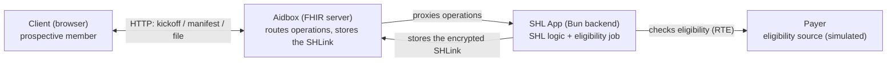

# SMART Health Links: Async Eligibility Sharing

A small TypeScript ([Bun](https://bun.sh)) implementation of [SMART Health Links (SHL)](https://hl7.org/fhir/uv/smart-health-cards-and-links/STU1/links-specification.html) on Aidbox. It shares the result of a slow **real-time eligibility (RTE)** check with a client that has no account, and keeps that result private to the client.

## Use case

Someone is thinking about signing up. First they want to know: *am I covered, and what will it cost me?* They have no account yet, so nothing can log them in. The answer also takes a few seconds, because the app has to check coverage with the payer.

From the person's side:

1. **They enter their details** (name, insurance/payer, member ID) and start the check.
2. **They get a link back right away** (a `shlink:`). It carries a one-time key that only they hold. The coverage check runs in the background.
3. **They wait** while the app asks "is the result ready yet?" until the payer answers.
4. **They see the result.** The app fetches the encrypted answer and decrypts it on their device with the key from the link.

The link carries a key because there is no logged-in user to protect the data, and the answer isn't ready when the request comes in. The key is the only secret: the server stores nothing but ciphertext, the endpoints that serve it stay public, and only the person holding the link can read the result. No account, and nothing readable sits on the server.

## Architecture



**Components:**
- **FHIR Server**: Aidbox with [custom operation routing](https://www.health-samurai.io/docs/aidbox/app-development/aidbox-sdk/apps) and a `SHLink` [custom resource](https://www.health-samurai.io/docs/aidbox/tutorials/artifact-registry-tutorials/custom-resources).
- **Application**: Bun/TypeScript service implementing the SHL kickoff, manifest, and file operations.

**Output:** the content shared through the link is a FHIR `CoverageEligibilityResponse`, encrypted as a JWE (`alg: dir`, `enc: A256GCM`) under the SHL key.

## Flow

```mermaid
sequenceDiagram
    actor C as Client (browser)
    participant A as Aidbox (FHIR server)
    participant S as SHL App (Bun backend)
    participant P as Payer

    C->>A: POST $kickoff (member details)
    A->>S: Aidbox routes the call to the backend
    S-->>C: shlink: + key (returned right away)

    Note over S,P: background job (the payer call is simulated here)
    S->>P: check eligibility (RTE)
    P-->>S: eligibility result
    S->>A: encrypt the result, store it on the SHLink

    C->>A: POST manifest (poll, no auth)
    A->>S: Aidbox routes the call to the backend
    S-->>C: status; once ready, the encrypted file
    Note over C: decrypt locally with the key from the link
```

## Aidbox resources

The [init bundle](init-bundle/bundle.json) provisions four resources at startup. The flow creates two more at runtime.

| Resource | Created | Why |
|----------|---------|-----|
| `Client/shl-client` | init bundle | The M2M client the Bun app uses to call Aidbox's FHIR API (Basic auth). |
| `AccessPolicy/shl-client-policy` | init bundle | Grants `shl-client` access to Aidbox (`allow` engine). |
| `StructureDefinition/SHLink` | init bundle | Defines the `SHLink` [custom resource](https://www.health-samurai.io/docs/aidbox/tutorials/artifact-registry-tutorials/custom-resources): the server-side state of one link (key, encrypted file, job status, passcode, throttling, file tokens). |
| `App/shl-app` | init bundle | Registers the app and routes the three operations: `$kickoff` (authenticated), `manifest` and `file` (public). |
| `SHLink/{id}` | runtime, one per kickoff | Holds that link's key and job status, then the encrypted JWE once the result is ready. |
| `CoverageEligibilityResponse/{id}` | runtime, one per check | The eligibility result the job produces. Its JSON is what gets encrypted into the link. |

## SHL endpoints

All three are Aidbox App operations, proxied to the Bun service. Manifest and file are **public** (bound to an `allow` policy); kickoff is authenticated.

| Operation | Method | Path | Auth | Purpose |
|-----------|--------|------|------|---------|
| `shl-kickoff` | POST | `/shl-app/eligibility/$kickoff` | required | Start an RTE job, mint a `shlink:` |
| `shl-manifest` | POST | `/shl-app/manifest/{shlId}` | public | SHL manifest request |
| `shl-file` | GET | `/shl-app/file/{fileId}` | public | Short-lived encrypted file fetch |

The Bun app also serves the demo UI directly (not via Aidbox): `GET /` (the viewer) and `POST /demo/kickoff` (an unauthenticated convenience trigger the viewer uses to start a check; see the note under "Testing the flow").

## Quick Start

### Prerequisites
- Docker and Docker Compose
- [Bun](https://bun.sh) 1.x (for local development)

### Running the application

1. **Create .env file** (optional; defaults match `docker-compose.yaml`):
   ```bash
   cp .env.example .env
   ```

2. **Run docker compose**:
   ```bash
   docker compose up --build
   ```

3. **Initialize Aidbox**: navigate to the [Aidbox UI](http://localhost:8080) and [activate the instance](https://www.health-samurai.io/docs/aidbox/getting-started/run-aidbox-locally#activate-your-aidbox-instance). The init bundle registers the `shl-client`, the `SHLink` custom resource, and the `shl-app` App.

4. **Open the viewer**: the SHL viewer is at [http://localhost:3000](http://localhost:3000). After you kick off a check (below), the returned `shlink:` opens straight into it.

### Local development (without Docker for the app)

```bash
bun install
bun run dev      # watch mode
```

## Testing the flow

### The whole flow in the browser (recommended)

Open the viewer at **[http://localhost:3000](http://localhost:3000)**. It runs the entire use case end to end:

1. **Start a check.** Enter a member name, payer, and member ID, then press **Start check**. This mints a `shlink:` (shown with a copy button) and starts the async eligibility job.
2. **Watch it resolve.** The stepper runs the real receiver protocol: decode the link → **poll the manifest** (`can-change` while the job runs, then `finalized`) → fetch the encrypted file → **decrypt in your browser** (WebCrypto AES-256-GCM). Click any step to expand the exact HTTP call behind it: the real request and the live response it received (long keys and JWEs truncated for readability).
3. **Read the result.** The decrypted `CoverageEligibilityResponse` renders inline. The key never leaves the page, and the server only ever sees ciphertext.

The **Open a link** tab runs just the receiver half. Paste any `shlink:`, or open a viewer-prefixed link, which fills it in and runs automatically.

> The viewer's **Start check** calls an unauthenticated demo route (`POST /demo/kickoff`) on the app so the browser holds no Aidbox credentials. In production, kickoff is the authenticated `shl-kickoff` operation triggered by a back-office service.

### The same flow at the API level

Use the [Aidbox REST Console](http://localhost:8080/u/rest) or `curl`.

#### 1. Kick off an eligibility check

```http
POST /shl-app/eligibility/$kickoff
Content-Type: application/fhir+json

{
  "resourceType": "Parameters",
  "parameter": [
    { "name": "memberName", "valueString": "Jane Prospect" },
    { "name": "payerName",  "valueString": "Acme Health" },
    { "name": "memberId",   "valueString": "M-99887" }
  ]
}
```

Response:
```json
{
  "resourceType": "Parameters",
  "parameter": [
    { "name": "shlinkId",    "valueString": "029f90da-..." },
    { "name": "shlink",      "valueString": "shlink:/eyJ1cmwiOiJodHRw..." },
    { "name": "manifestUrl", "valueString": "http://localhost:8080/shl-app/manifest/029f90da-..." }
  ]
}
```

#### 2. Poll the manifest (no auth required)

```http
POST /shl-app/manifest/{shlId}
Content-Type: application/json

{ "recipient": "Jane on her phone" }
```

While the job runs:
```json
{ "status": "can-change", "files": [] }
```

After ~10s (the simulated RTE delay), the result is ready:
```json
{
  "status": "finalized",
  "files": [
    { "contentType": "application/fhir+json", "embedded": "<JWE compact serialization>" }
  ]
}
```

If you send `embeddedLengthMax` smaller than the JWE, the manifest returns a short-lived `location` URL instead of `embedded`:
```http
GET /shl-app/file/{fileId}    # returns the JWE as application/jose
```

#### 3. Decrypt the result

In the browser, use the viewer above. In code, the `shlink:` payload (base64url JSON) contains the `key`. Decode it and decrypt the JWE with AES-256-GCM:

```ts
import { decodeShlink } from "./src/utils/shl-encode.ts";
import { decryptJwe } from "./src/utils/crypto.ts";

const payload = decodeShlink(shlink);              // { url, key, flag: "L", label, v }
const fhir = JSON.parse(await decryptJwe(jwe, payload.key));
// -> CoverageEligibilityResponse
```

Only the `key` from the `shlink:` decrypts the file. Without it the ciphertext is unreadable, so the result stays private to the client that started the job.

## Project layout

```
src/
├── server.ts                 # Bun.serve; dispatches Aidbox operations + serves the viewer
├── viewer.html               # browser SHL viewer (client-side WebCrypto decryption)
├── handlers/
│   └── shl.ts                # kickoff / manifest / file handlers
├── services/
│   ├── fhir-client.ts        # wraps @health-samurai/aidbox-client (Basic auth)
│   ├── shlink-store.ts       # SHLink custom-resource persistence
│   ├── eligibility.ts        # builds the CoverageEligibilityResponse (RTE result)
│   └── shl-service.ts        # mint / manifest / file orchestration + async job
├── types/
│   ├── config.ts             # env-driven config
│   ├── operation.ts          # Aidbox operation request envelope
│   ├── shl.ts                # SHL payload / manifest types
│   └── shlink-resource.ts    # SHLink custom resource shape
└── utils/
    ├── crypto.ts             # key generation + JWE encrypt/decrypt (jose)
    └── shl-encode.ts         # shlink: encode/decode
```

## Protocol hardening

The example also implements the security-sensitive plumbing of the SHL spec, the parts you don't want every integrator reimplementing:

- **Passcode (`P` flag)**: pass a `passcode` to kickoff and the link carries `flag: "LP"`. The manifest then requires it. A missing one returns `401 { "message": "Passcode required" }`, a wrong one returns `401 { "remainingAttempts": N }`. The attempt counter is a **lifetime** total persisted on the `SHLink` (and decremented before responding), so it holds up against parallel guessing. Once it hits zero the link locks, and even the correct passcode then resolves to `no-longer-valid`.
- **Short-lived `location` URLs**: when the manifest hands back a `location` instead of an `embedded` file, it mints a per-request token with an expiry (`SHL_FILE_TOKEN_TTL_SECONDS`, default 60s; the spec allows ≤ 1 hour). Fetching after it expires returns `410 Gone`.
- **Poll throttling**: polling one link's manifest faster than `SHL_MANIFEST_MIN_INTERVAL_SECONDS` returns `429` with a `Retry-After` header, which the viewer honors.

Tunable via env (see `.env.example`): `SHL_PASSCODE_MAX_ATTEMPTS`, `SHL_FILE_TOKEN_TTL_SECONDS`, `SHL_MANIFEST_MIN_INTERVAL_SECONDS`.

## Notes & scope

- **Flags**: uses `L` (long-term, since the manifest evolves pending → ready) and optionally `P` (passcode). It does not implement `U` (direct file); see the SHL spec.
- **Key storage**: the SHL key is persisted on the `SHLink` resource so the background worker can encrypt the result once the RTE job finishes. In production you'd avoid long-term key storage (hold it only in the worker, or encrypt-on-write and discard). This is the one deliberate simplification, called out because it's the central security tradeoff of the design.
- **Out of scope**: real payer RTE (270/271) integration, `location` single-use enforcement (only expiry is enforced here), key rotation.
