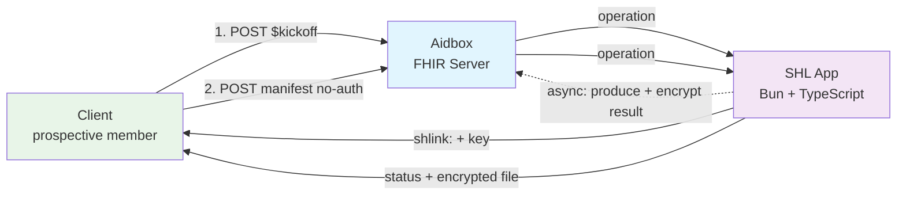

# SMART Health Links — Async Eligibility Sharing

A minimal TypeScript ([Bun](https://bun.sh)) implementation of [SMART Health Links (SHL)](https://hl7.org/fhir/uv/smart-health-cards-and-links/STU1/links-specification.html), integrated with Aidbox, that securely shares the result of a long-running **real-time eligibility (RTE)** check with an **unauthenticated** client.

## Use case

A prospective member wants to check whether they're eligible for a service **before** registering — so there is no authenticated user yet. The eligibility lookup is asynchronous and can take a while:

1. The client **kicks off** the check and immediately receives a `shlink:` (containing a one-time encryption key).
2. The client **polls** the SHL manifest. While the job runs, the manifest reports `can-change`.
3. When the result is ready, the manifest reports `finalized` and serves the result **encrypted**.
4. The client **decrypts** the result with the key from its `shlink:`.

The security property that makes this work without auth: **the SHL key is the only secret**. The server only ever stores ciphertext, the manifest/file endpoints are public, and only the client that kicked off the job (the holder of the key) can read the result — exactly the requirement that motivated this example.

## Architecture



**Components:**
- **FHIR Server**: Aidbox with [custom operation routing](https://www.health-samurai.io/docs/aidbox/app-development/aidbox-sdk/apps) and a `SHLink` [custom resource](https://www.health-samurai.io/docs/aidbox/tutorials/artifact-registry-tutorials/custom-resources).
- **Application**: Bun/TypeScript service implementing the SHL kickoff, manifest, and file operations.
- **Result**: A FHIR `CoverageEligibilityResponse`, encrypted as a JWE (`alg: dir`, `enc: A256GCM`) under the SHL key.

## SHL endpoints

All three are Aidbox App operations, proxied to the Bun service. Manifest and file are **public** (bound to an `allow` policy); kickoff is authenticated.

| Operation | Method | Path | Auth | Purpose |
|-----------|--------|------|------|---------|
| `shl-kickoff` | POST | `/shl-app/eligibility/$kickoff` | required | Start an RTE job, mint a `shlink:` |
| `shl-manifest` | POST | `/shl-app/manifest/{shlId}` | public | SHL manifest request |
| `shl-file` | GET | `/shl-app/file/{fileId}` | public | Short-lived encrypted file fetch |

The Bun app also serves the demo UI directly (not via Aidbox): `GET /` (the viewer) and `POST /demo/kickoff` (an unauthenticated convenience trigger the viewer uses to start a check — see the note under "Testing the flow").

## Quick Start

### Prerequisites
- Docker and Docker Compose
- [Bun](https://bun.sh) 1.x (for local development)

### Running the application

1. **Create .env file** (optional — defaults match `docker-compose.yaml`):
   ```bash
   cp .env.example .env
   ```

2. **Run docker compose**:
   ```bash
   docker compose up --build
   ```

3. **Initialize Aidbox**: navigate to the [Aidbox UI](http://localhost:8080) and [activate the instance](https://www.health-samurai.io/docs/aidbox/getting-started/run-aidbox-locally#activate-your-aidbox-instance). The init bundle registers the `shl-client`, the `SHLink` custom resource, and the `shl-app` App.

4. **Open the viewer**: the SHL viewer is at [http://localhost:3000](http://localhost:3000). After you kick off a check (below), the returned `shlink:` opens straight into it.

### Local development (without Docker for the app)

```bash
bun install
bun run dev      # watch mode
```

## Testing the flow

### The whole flow in the browser (recommended)

Open the viewer at **[http://localhost:3000](http://localhost:3000)** — it drives the entire use case end to end:

1. **Start a check** — enter a member name, payer, and member ID, then press **Start check**. This mints a `shlink:` (shown with a copy button) and starts the async eligibility job.
2. **Watch it resolve** — the stepper runs the real receiver protocol: decode the link → **poll the manifest** (`can-change` while the job runs, then `finalized`) → fetch the encrypted file → **decrypt in your browser** (WebCrypto AES-256-GCM). **Click any step** to expand the exact HTTP call behind it — the real request and the live response it received (long keys/JWEs truncated for readability).
3. **Read the result** — the decrypted `CoverageEligibilityResponse` renders inline. The key never leaves the page; the server only ever sees ciphertext.

The **Open a link** tab does just the receiver half — paste any `shlink:` (or open a viewer-prefixed link, which fills it in and runs automatically).

> The viewer's **Start check** calls an unauthenticated demo route (`POST /demo/kickoff`) on the app so the browser holds no Aidbox credentials. In production, kickoff is the authenticated `shl-kickoff` operation triggered by a back-office service.

### The same flow at the API level

Use the [Aidbox REST Console](http://localhost:8080/u/rest) or `curl`.

#### 1. Kick off an eligibility check

```http
POST /shl-app/eligibility/$kickoff
Content-Type: application/fhir+json

{
  "resourceType": "Parameters",
  "parameter": [
    { "name": "memberName", "valueString": "Jane Prospect" },
    { "name": "payerName",  "valueString": "Acme Health" },
    { "name": "memberId",   "valueString": "M-99887" }
  ]
}
```

Response:
```json
{
  "resourceType": "Parameters",
  "parameter": [
    { "name": "shlinkId",    "valueString": "029f90da-..." },
    { "name": "shlink",      "valueString": "shlink:/eyJ1cmwiOiJodHRw..." },
    { "name": "manifestUrl", "valueString": "http://localhost:8080/shl-app/manifest/029f90da-..." }
  ]
}
```

#### 2. Poll the manifest (no auth required)

```http
POST /shl-app/manifest/{shlId}
Content-Type: application/json

{ "recipient": "Jane on her phone" }
```

While the job runs:
```json
{ "status": "can-change", "files": [] }
```

After ~10s (the simulated RTE delay), the result is ready:
```json
{
  "status": "finalized",
  "files": [
    { "contentType": "application/fhir+json", "embedded": "<JWE compact serialization>" }
  ]
}
```

If you send `embeddedLengthMax` smaller than the JWE, the manifest returns a short-lived `location` URL instead of `embedded`:
```http
GET /shl-app/file/{fileId}    # returns the JWE as application/jose
```

#### 3. Decrypt the result

In the browser, use the viewer above. In code, the `shlink:` payload (base64url JSON) contains the `key` — decode it and decrypt the JWE with AES-256-GCM:

```ts
import { decodeShlink } from "./src/utils/shl-encode.ts";
import { decryptJwe } from "./src/utils/crypto.ts";

const payload = decodeShlink(shlink);              // { url, key, flag: "L", label, v }
const fhir = JSON.parse(await decryptJwe(jwe, payload.key));
// -> CoverageEligibilityResponse
```

Only the `key` from the `shlink:` decrypts the file. Without it, the ciphertext is unreadable — which is how the result stays private to the client that started the job.

## Project layout

```
src/
├── server.ts                 # Bun.serve; dispatches Aidbox operations + serves the viewer
├── viewer.html               # browser SHL viewer (client-side WebCrypto decryption)
├── handlers/
│   └── shl.ts                # kickoff / manifest / file handlers
├── services/
│   ├── fhir-client.ts        # wraps @health-samurai/aidbox-client (Basic auth)
│   ├── shlink-store.ts       # SHLink custom-resource persistence
│   ├── eligibility.ts        # builds the CoverageEligibilityResponse (RTE result)
│   └── shl-service.ts        # mint / manifest / file orchestration + async job
├── types/
│   ├── config.ts             # env-driven config
│   ├── operation.ts          # Aidbox operation request envelope
│   ├── shl.ts                # SHL payload / manifest types
│   └── shlink-resource.ts    # SHLink custom resource shape
└── utils/
    ├── crypto.ts             # key generation + JWE encrypt/decrypt (jose)
    └── shl-encode.ts         # shlink: encode/decode
```

## Protocol hardening

Beyond the happy path, the example implements the security-sensitive plumbing of the SHL spec — the parts you don't want every integrator reimplementing:

- **Passcode (`P` flag)** — pass a `passcode` to kickoff and the link carries `flag: "LP"`. The manifest then requires it: a missing one returns `401 { "message": "Passcode required" }`, a wrong one returns `401 { "remainingAttempts": N }`. The attempt counter is a **lifetime** total persisted on the `SHLink` (and decremented before responding), so it holds up against parallel guessing. Once it hits zero the link locks — even the correct passcode then resolves to `no-longer-valid`.
- **Short-lived `location` URLs** — when the manifest hands back a `location` instead of an `embedded` file, it mints a per-request token with an expiry (`SHL_FILE_TOKEN_TTL_SECONDS`, default 60s; the spec allows ≤ 1 hour). Fetching after it expires returns `410 Gone`.
- **Poll throttling** — polling one link's manifest faster than `SHL_MANIFEST_MIN_INTERVAL_SECONDS` returns `429` with a `Retry-After` header; the viewer honors it.

Tunable via env (see `.env.example`): `SHL_PASSCODE_MAX_ATTEMPTS`, `SHL_FILE_TOKEN_TTL_SECONDS`, `SHL_MANIFEST_MIN_INTERVAL_SECONDS`.

## Notes & scope

- **Flags**: uses `L` (long-term, since the manifest evolves pending → ready) and optionally `P` (passcode). It does not implement `U` (direct file) — see the SHL spec.
- **Key storage**: the SHL key is persisted on the `SHLink` resource so the background worker can encrypt the result once the RTE job finishes. In production you'd avoid long-term key storage (hold it only in the worker, or encrypt-on-write and discard) — this is the one deliberate simplification, flagged because it's the central security tradeoff of the design.
- **Out of scope**: real payer RTE (270/271) integration, `location` single-use enforcement (only expiry is enforced here), key rotation.
