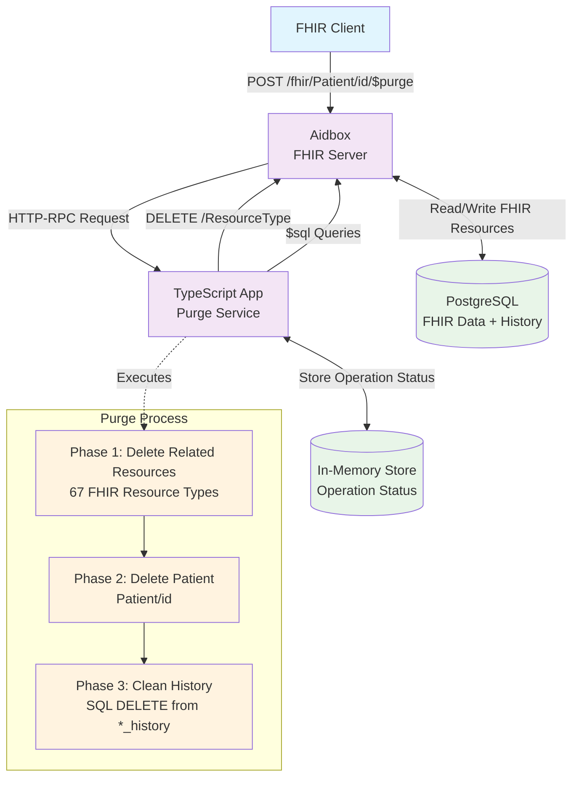

# FHIR $purge Operation with Aidbox

This example demonstrates the implementation of the [FHIR $purge operation](https://build.fhir.org/patient-operation-purge.html) using TypeScript and Aidbox. The $purge operation removes all current and historical versions of resources associated with a specific patient.

The application provides a complete asynchronous implementation of patient data purging, including related resources cleanup and history removal from the database.

## Prerequisites

- [Docker](https://www.docker.com/) and Docker Compose
- [Node.js](https://nodejs.org/) (v18 or later) and npm
- [curl](https://curl.se/) for HTTP requests
- [jq](https://jqlang.github.io/jq/) for JSON processing and formatting

## Setting Up Aidbox

1. Clone the repository:
```bash
git clone git@github.com:Aidbox/examples.git 
```

2. Change to the project directory:
```bash
cd examples/dollar-purge-operation
```

3. Start Aidbox and PostgreSQL:
```bash
docker compose up
```

4. The init bundle will automatically configure:
   - **App resource** for the $purge operation endpoint
   - **Basic Client** for API authentication 
   - **Access Policies** for DELETE operations and $sql queries

5. Aidbox will be available at http://localhost:8888

## Running the Application

1. Install dependencies:
```bash
npm install
```

2. Start the TypeScript development server:
```bash
npm run dev
```

3. The purge service will be available at http://localhost:3000

## Testing the $purge Operation

**Ready-to-use test resources:** The init bundle automatically creates test data:
- **Patient/test-patient-1**: John Doe (male, born 1980-01-01)
- **Observation**: Blood pressure reading linked to test patient
- **Encounter**: Ambulatory visit linked to test patient  
- **Condition**: Hypertension diagnosis linked to test patient

### Option 1: Use Pre-created Test Patient

```bash
# Verify test patient exists
curl "http://localhost:8888/Patient/test-patient-1" \
  -H "Authorization: Basic YmFzaWM6c2VjcmV0" | jq .

# Execute $purge on test patient
curl -X POST "http://localhost:8888/fhir/Patient/test-patient-1/\$purge" \
  -H "Authorization: Basic YmFzaWM6c2VjcmV0" \
  -H "Content-Type: application/json" | jq .
```

### Option 2: Create Your Own Test Patient

```bash
curl -X PUT "http://localhost:8888/Patient/test-patient-123" \
  -H "Authorization: Basic YmFzaWM6c2VjcmV0" \
  -H "Content-Type: application/json" \
  -d '{
    "resourceType": "Patient",
    "id": "test-patient-123", 
    "name": [{"given": ["Test"], "family": "Patient"}],
    "birthDate": "1990-01-01"
  }' | jq .
```

### 2. Create Related Resources

```bash
# Create an Observation
curl -X POST "http://localhost:8888/Observation" \
  -H "Authorization: Basic YmFzaWM6c2VjcmV0" \
  -H "Content-Type: application/json" \
  -d '{
    "resourceType": "Observation",
    "status": "final",
    "code": {"text": "Test observation"},
    "subject": {"reference": "Patient/test-patient-123"}
  }' | jq .

# Create an Encounter
curl -X POST "http://localhost:8888/Encounter" \
  -H "Authorization: Basic YmFzaWM6c2VjcmV0" \
  -H "Content-Type: application/json" \
  -d '{
    "resourceType": "Encounter", 
    "status": "finished",
    "class": {"code": "AMB"},
    "subject": {"reference": "Patient/test-patient-123"}
  }' | jq .
```

### 3. Execute $purge Operation

```bash
curl -X POST "http://localhost:8888/fhir/Patient/test-patient-123/\$purge" \
  -H "Authorization: Basic YmFzaWM6c2VjcmV0" \
  -H "Content-Type: application/json" | jq .
```

Expected response:
```json
{
  "resourceType": "OperationOutcome",
  "issue": [{
    "severity": "information", 
    "code": "informational",
    "details": {
      "text": "Purge operation started with ID: purge-1234567890-abcdef. Check status at /purge-status/purge-1234567890-abcdef"
    }
  }]
}
```

### 4. Check Operation Status

```bash
curl "http://localhost:3000/purge-status/purge-1234567890-abcdef" | jq .
```

### 5. Verify Resources are Deleted

```bash
# Patient should return 404
curl "http://localhost:8888/Patient/test-patient-123" \
  -H "Authorization: Basic YmFzaWM6c2VjcmV0" | jq .

# Related resources should also be deleted
curl "http://localhost:8888/Observation?subject=Patient/test-patient-123" \
  -H "Authorization: Basic YmFzaWM6c2VjcmV0" | jq .
```

## What's Going On Under the Hood?

### Three-Phase Purge Algorithm

The $purge operation implements a comprehensive 3-phase deletion process:

#### Phase 1: Delete Related Resources
- Processes **67 different FHIR resource types** that may reference the patient
- Uses **Conditional DELETE** for efficient bulk deletion: `DELETE /ResourceType?patient=Patient/{id}`
- **Fallback mechanism**: If conditional delete fails with "multiple matches" error, falls back to individual DELETE operations
- Resource types include: Observation, Encounter, Condition, AllergyIntolerance, CarePlan, and 62 others

#### Phase 2: Delete Patient
- Removes the patient resource itself: `DELETE /Patient/{id}`

#### Phase 3: Clean History Tables  
- Uses **$sql operation** to remove historical versions from `*_history` tables
- Executes SQL queries like: `DELETE FROM observation_history WHERE resource->>'subject' = 'Patient/{id}'`
- Ensures complete data removal including audit trail

### Asynchronous Processing

```typescript
// Operation tracking
const operation = {
  id: "purge-1234567890-abcdef",
  status: "in-progress", // "completed" | "failed"
  progress: {
    totalResourceTypes: 67,
    processedResourceTypes: 23,
    deletedResourcesCount: 156,
    currentResourceType: "Observation"
  }
}
```

### Error Handling

- **Graceful degradation**: Continues processing even if some resource types fail
- **Multiple matches fallback**: Automatically switches to individual DELETE when conditional DELETE fails
- **Partial success tracking**: Reports which resources were successfully deleted
- **Comprehensive error logging**: All failures are recorded in the operation outcome

## Useful jq Commands

### Extract Operation ID from $purge Response
```bash
# Get operation ID from the purge response
OPERATION_ID=$(curl -X POST "http://localhost:8888/fhir/Patient/test-patient-1/\$purge" \
  -H "Authorization: Basic YmFzaWM6c2VjcmV0" \
  -H "Content-Type: application/json" -s | jq -r '.issue[0].details.text | match("ID: ([^.]+)") | .captures[0].string')

echo "Operation ID: $OPERATION_ID"
```

### Extract Status Information
```bash
# Get current status
curl "http://localhost:3000/purge-status/$OPERATION_ID" -s | jq -r '.issue[0].details.text'

# Get detailed progress
curl "http://localhost:3000/purge-status/$OPERATION_ID" -s | jq '.extension[0].valueString | fromjson | {status, progress, errors: (.errors | length)}'

# Check if operation is completed
curl "http://localhost:3000/purge-status/$OPERATION_ID" -s | jq -r '.extension[0].valueString | fromjson | .status'
```

### Monitor Progress
```bash
# Watch operation progress (requires watch command)
watch 'curl "http://localhost:3000/purge-status/'$OPERATION_ID'" -s | jq -r ".issue[0].details.text"'

# Get progress percentage
curl "http://localhost:3000/purge-status/$OPERATION_ID" -s | jq -r '.extension[0].valueString | fromjson | "\(.progress.processedResourceTypes)/\(.progress.totalResourceTypes) (\((.progress.processedResourceTypes / .progress.totalResourceTypes * 100) | floor)%)"'
```

### List All Operations
```bash
# Get all operations with status
curl "http://localhost:3000/purge-operations" -s | jq '.operations[] | {id, patientId, status, errorCount}'

# Get only completed operations
curl "http://localhost:3000/purge-operations" -s | jq '.operations[] | select(.status == "completed")'

# Get operations with errors
curl "http://localhost:3000/purge-operations" -s | jq '.operations[] | select(.errorCount > 0)'
```

### Complete Workflow Automation

## API Endpoints

### Primary Endpoints (via Aidbox)

| Method | Endpoint | Description |
|--------|----------|-------------|
| `POST` | `/fhir/Patient/{id}/$purge` | Start purge operation for patient |

### Monitoring Endpoints (Direct to TypeScript service)

| Method | Endpoint | Description |
|--------|----------|-------------|
| `GET` | `/purge-status/{operationId}` | Check operation status |
| `GET` | `/purge-operations` | List all operations |
| `GET` | `/health` | Health check |
| `POST` | `/test-purge/{patientId}` | Direct test endpoint |

## FHIR $purge Operation Specification

According to the [FHIR specification](https://build.fhir.org/patient-operation-purge.html):

- **Purpose**: Remove all current and historical versions of resources associated with a patient
- **Scope**: Patient and all linked resources (observations, encounters, conditions, etc.)
- **Behavior**: Idempotent operation that can be safely retried
- **Return**: OperationOutcome with execution status
- **Maturity Level**: 2 (Trial Use)

### Implementation Notes

This implementation provides:
- ✅ **Complete resource coverage**: All 67 FHIR resource types that can reference patients
- ✅ **History cleanup**: Removes historical versions using database queries  
- ✅ **Asynchronous processing**: Prevents timeouts on large datasets
- ✅ **Progress tracking**: Real-time status updates
- ✅ **Error resilience**: Continues processing despite partial failures
- ✅ **Fallback mechanisms**: Handles edge cases like multiple matches

### Example: Successful Operation Response

```json
{
  "resourceType": "OperationOutcome",
  "issue": [{
    "severity": "information",
    "code": "success", 
    "details": {
      "text": "Purge completed successfully. Processed 67 resource types. Deleted 234 resources."
    }
  }]
}
```

### Example: Operation with Warnings

```json
{
  "resourceType": "OperationOutcome", 
  "issue": [{
    "severity": "warning",
    "code": "incomplete",
    "details": {
      "text": "Purge completed with errors. Processed 67 resource types. Deleted 230 resources. Errors: 3"
    }
  }]
}
```

## Architecture Overview



## Development

### Project Structure

```
dollar-purge-operation/
├── src/
│   ├── index.ts              # Express server
│   ├── purgeHandler.ts       # Main purge logic
│   ├── resourceDeletions.ts  # Resource type definitions
│   └── types.ts              # TypeScript interfaces
├── tasks/                    # Implementation tasks documentation
├── docker-compose.yml        # Aidbox + PostgreSQL
├── init-bundle.json          # Aidbox configuration
└── package.json              # Node.js dependencies
```

### Key Technologies

- **TypeScript**: Type-safe backend implementation
- **Express.js**: HTTP server for handling requests
- **Aidbox**: FHIR server and database
- **PostgreSQL**: Data storage with JSONB support
- **Docker Compose**: Local development environment

This implementation demonstrates a production-ready approach to implementing complex FHIR operations with proper error handling, monitoring, and data integrity guarantees.
