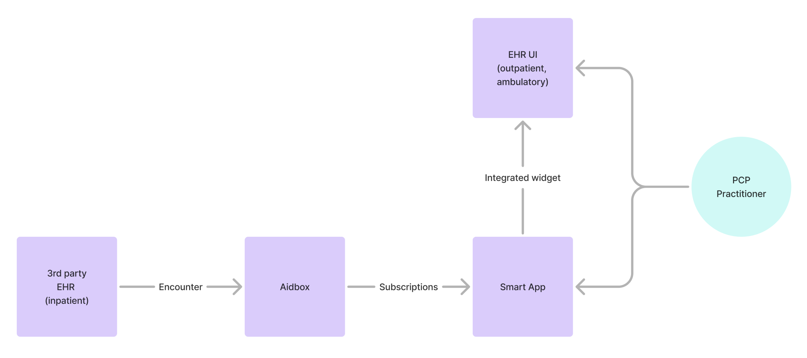

# smart-app-launch-subscriptions

The Smart App has a frontend and a backend.

## Running local example

To run the smart-app example locally, follow these steps:

**1. Start the backend**

Run the backend on your local machine. See the README file in the backend project for detailed instructions.

**2. Build the frontend**

Build the frontend locally. See the README file in the frontend project for the required steps.

**3. Open the example page**

After the frontend is built, open `launch.html` in your browser.

**4. Enjoy!**

# Component Diagram



# Interaction Diagram


# How to mock trigger in Aidbox


**1. Create SubscriptionTopic**
```
POST /fhir/AidboxSubscriptionTopic
content-type: application/json
accept: application/json

{
  "resourceType": "AidboxSubscriptionTopic",
  "url": "http://example.org/FHIR/R5/SubscriptionTopic/Encounter-in-progress",
  "status": "active",
  "trigger": [
    {
      "resource": "Encounter",
      "fhirPathCriteria": "Encounter.status = 'in-progress'"
    }
  ]
}
```

**2. Create TopicDestination**

```
POST /fhir/AidboxTopicDestination
content-type: application/json
accept: application/json

{
  "resourceType": "AidboxTopicDestination",
  "meta": {
    "profile": [
      "http://aidbox.app/StructureDefinition/aidboxtopicdestination-webhook-at-least-once"
    ]
  },
  "kind": "webhook-at-least-once",
  "id": "webhook-destination",
  "topic": "http://example.org/FHIR/R5/SubscriptionTopic/Encounter-in-progress",
  "parameter": [
    {
      "name": "endpoint",
      "valueUrl": "http://subscriptions:9000/subscriptions/webhook-to-post-all-new-subscriptions-aidbox"
    },
    {
      "name": "timeout",
      "valueUnsignedInt": 30
    },
    {
      "name": "maxMessagesInBatch",
      "valueUnsignedInt": 20
    },
    {
      "name": "header",
      "valueString": "User-Agent: Aidbox Server"
    }
  ],
  "content": "full-resource"
}
```

**3. Create encounter**
```
PUT /Encounter

{
  "resourceType": "Encounter",
  "id": "example-encounter",
  "subject": {
    "resourceType": "Patient",
    "id": "example-patient"
  },
  "class": {
    "code": "IMP",
    "system": "http://terminology.hl7.org/CodeSystem/v3-ActCode",
    "display": "inpatient encounter"
  },
  "status": "in-progress"
}
```

# Misc

For connection of webhook to local backend instance change `valueUrl` to this url: `http://host.docker.internal:9000/subscriptions/webhook-to-post-all-new-subscriptions-aidbox`
